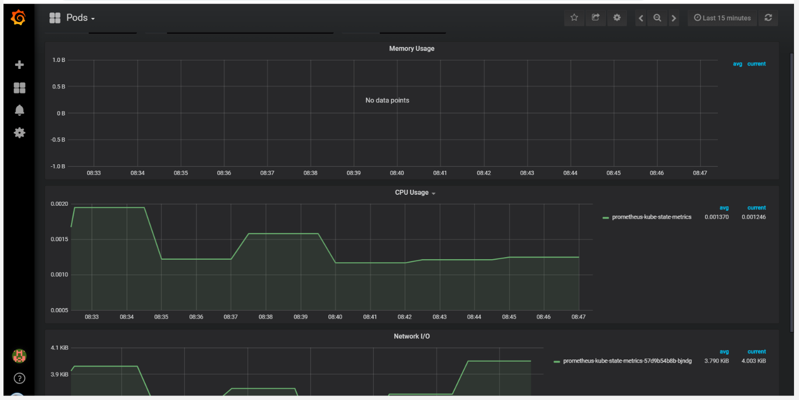

---

copyright:
  years: 2018, 2019
lastupdated: "2019-06-18"

---

{:shortdesc: .shortdesc}
{:new_window: target="_blank"}
{:codeblock: .codeblock}
{:pre: .pre}
{:screen: .screen}
{:tip: .tip}

# Known issues and limitations
{: #known-issues}

## Instability due to high cpu usage by the Firehose Prometheus exporter
{: #instabilityCPU-issue}

CFEE environments include a Prometheus Firehose exporter for collecting Cloud Foundry metrics on http and https _start_ and _stop_ requests . A CFEE environment with a high number of http requests may cause the Prometheus firehose exporter to use a large amount of CPU. This can lead to some instability in the environment since the firehouse exporter pod runs on one of the Cloud Foundry control plane worker nodes.

You can determine if the firehose exporter pod is using high CPU, and potentially causing instability in the CFEE environment, by one of the following methods:
1.  Check the overall CPU usage of the CF control plane via the CFEE Overview page for that CFEE environment. See an illustrative example of high-cpu usage below:


2. Check the CPU usage in the _Resource Usage > Applications_ page and see if there is an unusually high number of http requests. See an illustrative example of high-cpu usage below:


3. Check the POD Grafana console (launched from the _Monitoring_ page) that shows CPU usage for the Firehouse pod. See an illustrative example of high-cpu usage below:


If the firehouse exporter is using betwen 0.5 and 0.7 (50-70%) CPU, and the overall Control plane CPU is high, you may need to turn off the http request metric collection via the following steps:

1. Create the `config.yaml`:

   ```
   kubectl -n cf-monitoring get deployment firehose-exporter -f yaml > config.yaml.
   ```
   {: pre}

2. Edit the `config.yaml` and add the following line in `spec.template.spec.containers.args` array:

   ```
   - --filter.events=ContainerMetric,CounterEvent,ValueMetric
   ```

### Example

Original `config.yaml`:

```
  ...
  template:
  ...
    spec:
      containers:
      - args:
        ...
        - --doppler.metric-expiration=10m
        - --metrics.environment=IBM-Cloud-Foundry-Enterprise-Environment
        - --filter.events=ContainerMetric,CounterEvent,ValueMetric
        image: boshprometheus/firehose-exporter
```

The following command would reconfigure and restart the worker node pod:

```
kubectl -n cf-monitoring apply -f config.yaml.

```

For more information on the Firehose Prometheus exporter see [Cloud Foundry Firehose Prometheus exporter](https://github.com/bosh-prometheus/firehose_exporter){: new_window} .

## Intermittent error accessing cell metrics
{: #cellmetrics-issue}

When accessing Cloud Foundry cell metrics in the _Overview_ or _Resource Usage_ pages there is an intermittent error preventing the collection of those metrics from the Kubernetes worker nodes in which the cells are depoloyed.  Retry at a later time by refresing the page.

## Worker keeps hanging in reboot
{: #prometheus-worker-reboot}

It has been observed that due to a race condition it may happen that a worker
hosting a `prometheus-server` pod may keep hanging in reboot after a
`ibmcloud ks worker reboot` operation.

This situation can be detected if the `ibmcloud ks workers <cluster-name>`
command shows the respective worker in state `critical` and status `error*` for
more than 10 minutes:
```
ID                                                 Public IP         Private IP      Machine Type         State      Status   Zone    Version
kube-fra04-cr25e2765963834256813f44c2e42f48b2-w1   U.V.W.116         10.X.Y.Z        b2c.4x16.encrypted   critical   error*   fra04   1.12.7_1549
```
Also, the `ibmcloud ks worker-get --worker <worker-ID> --cluster <cluster-name> --json`
shows that a reboot is pending, but the worker fails to connect to the
cloud infrastructure:
```
...
    "state": "critical",
    "status": "Unknown",
    "statusDate": "",
    "statusDetails": "Rebooting: Attempting to reboot worker (attempt 3)",
    "errorMessage": "Connection to IBM Cloud infrastructure has failed",
...
```

Should that be the case, first try to hard reboot the worker. In most
cases, this clears the situation.
```
ibmcloud ks worker-reboot --cluster <cluster-name> --workers <worker-ID> --hard
```

Should that command fail also, the last resort is to reload the
worker node. This is done by first reloading the operating system, and then
reloading the Kubernetes node.

To have the operating system reloaded, point your browser to the
[Classic Infrastructure Device List](https://cloud.ibm.com/classic/devices),
and locate the respective worker in the table shown. Click on the worker name
link to see its details and select the `OS reload` action from the Actions menu.
**Note:** This activity can take more than an hour to complete.

Once the operating system has been brought back to its initial state, the
Kubernetes node can be reloaded:
```
ibmcloud ks worker-reload --cluster <cluster-name> --workers <worker-ID>
```

### Move Prometheus server to another worker before reboot

If you move the `prometheus-server` pod to the second worker which is reserved
for the monitoring components in your CFEE environment, you can prevent the
situation entirely.

First, check if the Prometheus server is actually running on the worker you
intend to reboot. Start with identifying the workers in your cluster:
```
ibmcloud ks workers --cluster <cluster-name>
```
The output shows you the workers in your cluster together with their IP addresses.

Then use
```
kubectl -n monitoring get pod -l app=prometheus,component=server -o wide
```
to check if the Prometheus server pod is running on the worker you want to
reboot by comparing the NODE IP address in the later command with the Private IP
addresses in the first command.

If you need to move the `prometheus-server` to the seconde monitoring worker,
cordon the current node, and delete the `prometheus-server` pod. Kubernetes
will then recreate the pod on the other worker. Don't forget to uncordon the
former node before rebooting it finally:
```
kubectl cordon <node-with-prometheus-server-pod>
kubectl -n monitoring delete pod/<prometheus-server-pod>
kubectl uncordon <node-with-prometheus-server-pod>
ibmcloud ks worker-reboot <node-with-previous-prometheus-server-pod>
```

## Known Errors

1. If a worker node deployment fails due to an IBM Kubernetes Service issue, you must redeploy the CFEE instance. This cannot be fixed without redeploying because CFEE instances are dependant on the IBM Kubernetes Service.

### Issues creating service instances

If you encounter this specific error when creating services in your CFEE instance

```
$ cf create-service cloudantnosqldb  alias service-alias -c '{"instance":"88cef195-85fe-4ca3-90a7-bd01447405f0"}'
Creating service instance service-alias in org org / space dev as user@ibm.com...
The service broker rejected the request to https://resource-controller.bluemix.net/ibmcloud-platform/907f6518-65cb-4500-8ac8-c07ec36db942/v2/service_instances/229e94e3-d16c-40f7-b050-7384cfbbe8cf?accepts_incomplete=true. Status Code: 400 Bad Request, Body: {"error_code":"RC-IamErrorResponse","message":"Account owner not found in user registry cfaas","status_code":400}

FAILED
```

The IAM Service ID used to create the service alias lacks the permission necessary to create the service. You can give the permission with the following steps:

1. Find the name of the service ID for your CFEE.
```
$ ibmcloud iam service-ids | grep "Auto generated serviceId for broker cfee-my-cfee-name"
ServiceId-34fc56fb-c2ab-484c-9608-de483cb285ca   cfee-my-cfee-name                                                   2019-11-14T00:50+0000   2019-11-14T00:50+0000   Auto generated serviceId for broker cfee-my-cfee-name
```

2. Create a service policy with the Viewer role for that service ID.
```
$ ibmcloud iam service-policy-create ServiceId-34fc56fb-c2ab-484c-9608-de483cb285ca --roles Viewer --service-name cfaas
```

3. After the service ID tokens expire (usually after 30 minutes), try to create the service instance again.
