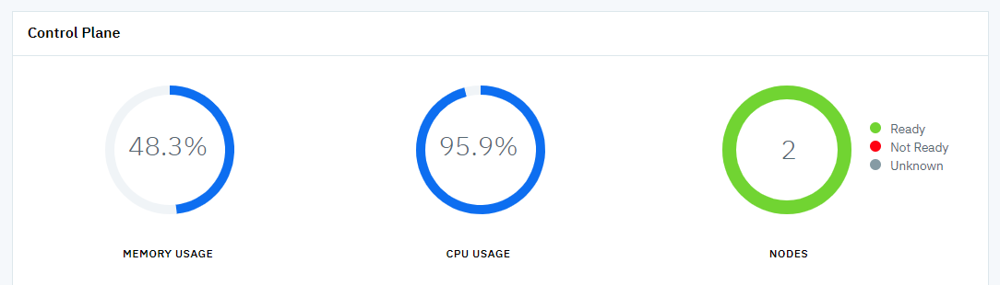
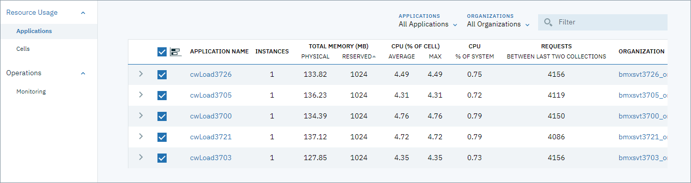

---

copyright:
  years: 2018
lastupdated: "2018-09-04"

---

{:shortdesc: .shortdesc}
{:new_window: target="_blank"}
{:codeblock: .codeblock}
{:pre: .pre}
{:screen: .screen}
{:tip: .tip}

# Known issues (limitations)
{: #known-issues}

## Instability due to high cpu usage by the Firehose Prometheus exporter

CFEE environments include a Prometheus Firehose exporter for collecting Cloud Foundry metrics on http and https _start_ and _stop_ requests . A CFEE environment with a high number of http requests may cause the Prometheus firehose exporter to use a large amount of CPU. This can lead to some instability in the environment since the firehouse exporter pod runs on one of the Cloud Foundry control plane worker nodes.

You can determine if the firehose exporter pod is using high CPU, and potentially causing instability in the CFEE environment, by one of the following methods: 
1.  Check the overall CPU usage of the CF control plane via the CFEE Overview page for that CFEE environment. See an illustrative example of high-cpu usage below:


2. Check the CPU usage in the _Resource Usage > Applications_ page and see if there is an unusually high number of http requests. See an illustrative example of high-cpu usage below:


3. Check the POD Grafana console (launched from the _Monitoring_ page) that shows CPU usage for the Firehouse pod. See an illustrative example of high-cpu usage below:


If the firehouse exporter is using betwen 0.5 and 0.7 (50-70%) CPU, and the overall Control plane CPU is high, you may need to turn off the http request metric collection via the following steps:

1. Create the `config.yaml`:

   ```
   kubectl -n cf-monitoring get deployment firehose-exporter -f yaml > config.yaml.
   ```
   {: pre}
  
2. Edit the `config.yaml` and add the following line in ```spec.template.spec.containers.args``` array:

   ```
   - --filter.events=ContainerMetric,CounterEvent,ValueMetric          
   ```

### Example

Original `config.yam`:

```
  ...
  template:
  ...
    spec:
      containers:
      - args:
        ...
        - --doppler.metric-expiration=10m
        - --metrics.environment=IBM-Cloud-Foundry-Enterprise-Environment
        - --filter.events=ContainerMetric,CounterEvent,ValueMetric
        image: boshprometheus/firehose-exporter
```  

The following command would reconfigure and restart the worker node pod:

```
kubectl -n cf-monitoring apply -f config.yaml.

```

See (Cloud Foundry Firehose Prometheus exporter](https://github.com/bosh-prometheus/firehose_exporter){: new_window} for more information on the Firehose Prometheus exporter.
