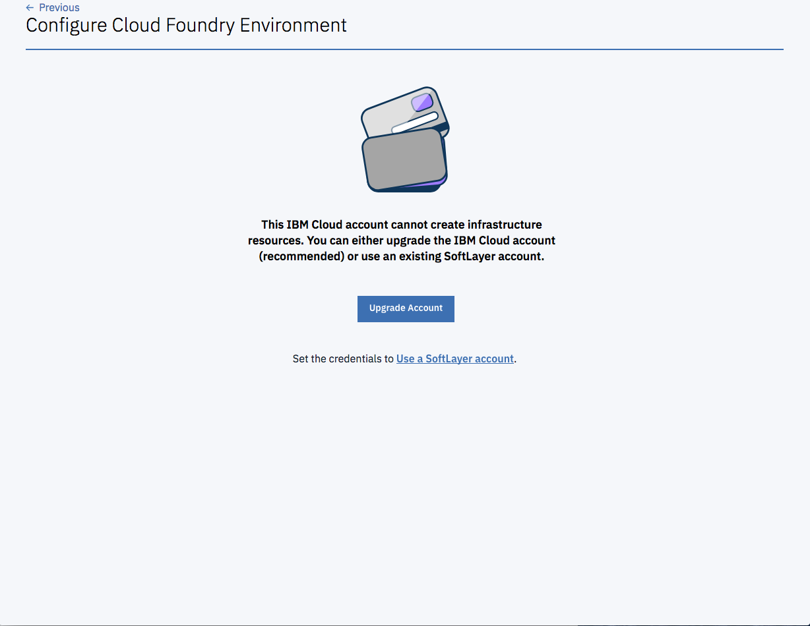

---

copyright:
  years: 2018
lastupdated: "2018-07-17"

---

{:shortdesc: .shortdesc}
{:new_window: target="_blank"}
{:codeblock: .codeblock}
{:pre: .pre}
{:screen: .screen}
{:tip: .tip}

# Preparación de su cuenta
{: #prepare}

Las instancias de CFEE se despliegan en recursos de infraestructura (nodos de trabajador de Kubernetes del servicio de IBM Container) que se facturan a la cuenta de IBM Cloud. Esto significa que la cuenta de IBM Cloud en la que se crea la instancia de CFEE debe ser una cuenta de pago (cuenta de Pago según uso o Suscripción).  Si la cuenta de IBM Cloud en la que intenta crear una instancia de CFEE es una cuenta de prueba, se le solicitará que actualice su cuenta cuando intente crear una instancia de CFEE.  Cuando se actualiza una cuenta de IBM Cloud (de una cuenta de prueba a una de Pago según uso o de suscripción), la cuenta de IBM Cloud se enlaza a una cuenta de SoftLayer (mediante la que se pueden crear recursos de infraestructura). Para obtener más información, consulte [Tipos de cuenta](https://console.bluemix.net/docs/account/index.html#accounts). El coste de estos recursos de infraestructura se muestra en su factura de IBM Cloud.

## Cómo determinar si la cuenta de IBM Cloud puede crear instancias de CFEE
{: #account-check}

Puede determinar si una cuenta de IBM Cloud es de prueba o de pago y si está enlazada a una cuenta de SoftLayer mirando la información de la cuenta en la esquina superior derecha del banner de IBM Cloud.

En el ejemplo siguiente el usuario _Mary Smith_ ha iniciado sesión en la cuenta de IBM Cloud _MyCompany_, que es una cuenta de prueba. 

En el ejemplo siguiente la misma cuenta de IBM Cloud _MyCompany_ se ha actualizado a una cuenta de pago.  Como resultado de la actualización, ahora la cuenta está enlazada a una cuenta de SoftLayer _1684806_.  Ambas cuentas se muestran en el campo "Cuenta".

Si la cuenta de IBM Cloud es de prueba, se le solicitará que la actualice cuando intente crear una instancia de CFEE. Observe la pantalla que se muestra a continuación:

## Utilización de una cuenta de SoftLayer en lugar de actualizar la cuenta de IBM Cloud
{: #account-linkswitching}

Si tiene el rol de Administrador en una cuenta de IBM Cloud, puede utilizar una cuenta de SoftLayer para crear la instancia de CFEE sin actualizar la cuenta de IBM Cloud.

**Aviso:** si utiliza una cuenta de SoftLayer ahora y actualiza la cuenta de IBM Cloud en el futuro (a una cuenta de Pago según uso o de suscripción), es posible que la cuenta de IBM Cloud actualizada siga utilizando la cuenta de SoftLayer (cuyas credenciales establece ahora) cuando cree recursos de infraestructura en el futuro. Además, si utiliza una cuenta de SoftLayer distinta en el futuro para crear Cloud Foundry Enterprise Environments, es posible que los usuarios de la cuenta de IBM Cloud no puedan acceder a los recursos de infraestructura creados con la cuenta de SoftLayer cuyas credenciales establece ahora. Le recomendamos que actualice en su lugar la cuenta de IBM Cloud.

Para utilizar una cuenta de SoftLayer sin actualizar la cuenta de IBM Cloud (observe la pantalla siguiente para ver ejemplos):
1. En la pantalla que se muestra cuando la cuenta de IBM Cloud no está actualizada, haga clic en **Utilizar una cuenta de SoftLayer**.
2. Introduzca el **Nombre de usuario** y **Clave de API** de una cuenta de SoftLayer. Para obtener el nombre de usuario y la clave de API de SoftLayer acceda a [Consola de SoftLayer](https://control.softlayer.com). Cuando haya iniciado sesión en SoftLayer, seleccione la cuenta que desea enlazar a la cuenta de {{site.data.keyword.Bluemix_notm}}. Al seleccionar la cuenta, se abre la página de perfil de la cuenta. Desplácese hasta el final de la página para buscar el nombre de usuario y la clave de API de la cuenta. Si no dispone de una clave de API, puede generarla si es el propietario de la cuenta. Si no es el propietario de la cuenta, pida al propietario de la cuenta que la genere.
3. Pulse en **Establecer credenciales**.

**Nota:** Debe tener los permisos suficientes en la cuenta de SoftLayer para crear un clúster de Kubernetes normal desde un servicio de IBM Container. Si no los tiene, pida al administrador de la cuenta de SoftLayer o al usuario que le ha dado acceso a la cuenta de SoftLayer que le proporcione los permisos adicionales.
