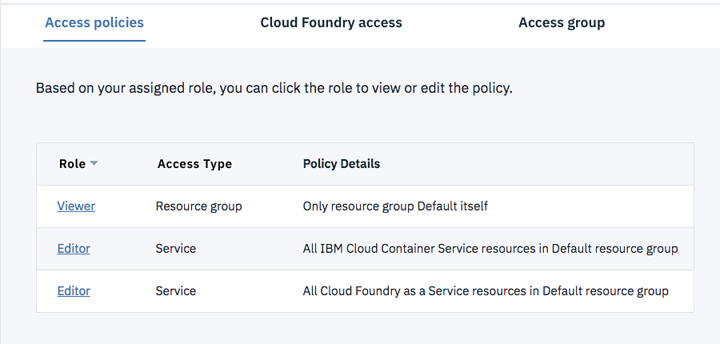

---

copyright:

  years: 2015, 2017, 2018

lastupdated: "2019-02-26"

---

{:shortdesc: .shortdesc}
{:new_window: target="_blank"}
{:codeblock: .codeblock}
{:pre: .pre}
{:screen: .screen}
{:tip: .tip}

# Droits
{: #permissions}

Pour que les utilisateurs puissent commencer à créer et à utiliser un service {{site.data.keyword.cfee_full}} (CFEE), un administrateur du compte où l'instance CFEE doit être créée doit au préalable leur accorder des droits d'accès. 

## Présentation des droits d'accès
{: #perm-summary}

Voici un récapitulatif des affectations de rôle [IAM](https://cloud.ibm.com/iam#/users) et [Cloud Foundry](https://cloud.ibm.com/account/cloud-foundry) minimales requises pour effectuer diverses tâches dans une instance CFEE. La dernière section décrit ces droits plus en détail.

|  **Tâches** &nbsp; &nbsp; &nbsp; &nbsp; &nbsp; &nbsp; &nbsp; &nbsp; &nbsp; &nbsp; &nbsp; &nbsp;|  **Rôles d'accès IAM** &nbsp; &nbsp; &nbsp; |**Rôles Cloud Foundry** &nbsp; &nbsp; &nbsp; |
|----------------------------------------|-------------------|-------------------|
|Créer un CFEE |  <ul><li>Rôle d'afficheur dans le groupe de ressources où le CFEE doit être créé.</li> <li>Rôle d'éditeur dans le service CFEE.</li> <li>Rôle administrateur dans le service Kubernetes.</li> <li>Rôle de plateforme d'éditeur et rôle d'accès au service de responsable dans le service IBM Cloud Object Storage.</li> </ul> | <ul><li>Rôle utilisateur dans une organisation publique.</li> <li>Rôle de développeur dans un espace de cette organisation publique. </li></ul>|
|Mettre à jour la version CFEE |  <ul><li>Rôle d'afficheur dans le groupe de ressources CFEE.</li> <li>Rôle de plateforme d'éditeur dans le service CFEE.</li></li> <li>Rôle d'opérateur dans le service Kubernetes.</li> <li>Rôle d'éditeur dans le service Cloud Object Storage.</li> </ul> | <ul><li>Rôle utilisateur dans une organisation publique.</li> <li>Rôle de développeur dans un espace de cette organisation publique. </li></ul>|
|Mettre à l'échelle la capacité du CFEE (ajouter/supprimer des cellules)|  <ul><li>Rôle d'afficheur dans le groupe de ressources de l'instance CFEE.</li> <li>Rôle d'administrateur dans l'instance CFEE.</li> <li>Rôle d'opérateur dans le service Kubernetes.</li> <li>Rôle d'éditeur dans le service Cloud Object Storage.</li> </ul> | |
|Surveiller le CFEE |  <ul><li>Rôle d'afficheur dans le groupe de ressources de l'instance CFEE.</li> <li>Rôle d'éditeur dans l'instance CFEE.</li> <li>Rôle d'opérateur dans le cluster Kubernetes de CFEE.</li></ul> |  |
|Afficher l'utilisation des ressources CFEE |  <ul><li>Rôle d'afficheur dans le groupe de ressources de l'instance CFEE.</li> <li>Rôle d'afficheur dans l'instance CFEE.</li></ul> |  |
|Activer un audit de CFEE| <ul><li>Rôle d'afficheur dans le groupe de ressources de l'instance CFEE.</li> <li>Rôle d'éditeur dans l'instance CFEE.</li></ul> | <ul><li>Rôle d'auditeur dans l'espace Cloud Foundry public où est déployée l'instance de service Activity Tracker.</li></ul>  |
|Afficher les événements d'audit de CFEE| <ul><li>Rôle d'afficheur dans le groupe de ressources de l'instance CFEE.</li> <li>Rôle d'éditeur dans l'instance CFEE.</li></ul> | <ul><li>Rôle d'auditeur dans l'espace Cloud Foundry public où est déployée l'instance de service Activity Tracker.</li></ul>  |
|Activer la persistance de journalisation CFEE| <ul><li>Rôle d'afficheur dans le groupe de ressources de l'instance CFEE.</li> <li>Rôle d'éditeur dans l'instance CFEE.</li></ul> |<ul><li>Rôle d'auditeur dans l'espace Cloud Foundry public où est déployée l'instance de service Log Analysis.</li></ul>  |
|Afficher les journaux persistants CFEE| <ul><li>Rôle d'afficheur dans le groupe de ressources de l'instance CFEE.</li> <li>Rôle d'éditeur dans l'instance CFEE.</li></ul> | <ul><li>Rôle d'auditeur dans l'espace Cloud Foundry public où est déployée l'instance de service Log Analysis.</li></ul> |
|Créer des organisations CFEE| <ul><li>Rôle d'afficheur dans le groupe de ressources de l'instance CFEE.</li> <li>Rôle d'éditeur dans l'instance CFEE.</li></ul> |  |
|Créer des espaces CFEE| <ul><li>Rôle d'afficheur dans le groupe de ressources de l'instance CFEE.</li> <li>Rôle d'afficheur dans l'instance CFEE.</li></ul> | <ul><li>Rôle de responsable dans l'organisation où l'espace doit être créé.</li></ul> |
|Gérer des domaines partagés|<ul><li>Afficheur dans le groupe de ressources de l'instance CFEE. </li><li>Rôle d'éditeur dans l'instance CFEE. </li></ul>|  |
|Afficher des domaines partagés|<ul><li>Afficheur dans le groupe de ressources de l'instance CFEE. </li><li>Rôle d'afficheur dans l'instance CFEE. </li></ul>|  |
|Gérer des domaines privés|<ul> <li>Afficheur dans le groupe de ressources de l'instance CFEE. </li><li>Rôle d'afficheur dans l'instance CFEE. </li></ul>| <ul><li>Rôle de responsable dans l'organisation propriétaire du domaine. </li></ul>|
|Afficher des domaines privés|<ul> <li>Rôle d'afficheur dans le groupe de ressources de l'instance CFEE. </li><li>Rôle d'afficheur dans l'instance CFEE. </li></ul>|<ul><li>Rôle d'afficheur dans l'organisation propriétaire du domaine. </li></ul>|
|Créer/Supprimer une instance de service IBM Cloud dans un espace CFEE| <ul><li>Rôle d'afficheur dans le groupe de ressources où le CFEE doit être créé.</li> <li>Rôle d'afficheur dans l'instance CFEE.</li> <li>Éditeur dans le groupe de ressources dans lequel l'instance de service doit être créée ou sur le service géré IAM à instancier.</li> </ul>| <ul><li>Rôle de développeur dans l'espace CFEE à partir duquel l'instance de service est créée (et où elle sera automatiquement ajoutée ou associée à un alias).</li></ul> |
|Ajouter/Supprimer une instance de service IBM Cloud dans/depuis un espace CFEE (par exemple, créer/supprimer un alias d'un service IBM Cloud dans un espace CFEE)| <ul><li>Rôle d'afficheur dans le groupe de ressources de l'instance CFEE.</li><li>Rôle d'afficheur dans l'instance CFEE. </li><li>Rôle de plateforme Opérateur et de service Lecteur pour l'instance de service à ajouter. </li></ul>|<ul><li>Rôle de développeur dans l'espace CFEE où l'instance de service doit être ajoutée (associée à un alias).</li></ul> |
|Lier ou dissocier une instance de service IBM Cloud dans un espace CFEE|<ul> <li>Rôle d'éditeur dans le groupe de ressources de l'instance de service à lier ou dissocier.</li><li>Rôle d'afficheur dans l'instance CFEE. </li><li>Rôle de plateforme Opérateur et de service Auteur pour l'instance de service à lier.</li></ul> | <ul><li>Rôle de développeur dans l'espace CFEE où l'instance de service doit être liée.</li></ul> |
|Emission de commandes d'interface de ligne de commande `cf`|<ul> <li>Rôle d'afficheur dans le groupe de ressources de l'instance CFEE. </li><li>Rôle d'afficheur dans l'instance CFEE.</li></ul> | <ul><li>Rôles Cloud Foundry dans l'organisation/espace requis pour effectuer la commande.</li></ul> |
{: caption="Tableau 1. Droits requis pour effectuer des tâches dans un CFEE" caption-side="top"}

## Droits requis pour créer un nouvel environnement
{: #perm-creating}

Pour que les utilisateurs puissent créer de nouvelles instances du service CFEE, un administrateur de compte doit leur accorder des droits d'accès, non seulement au service CFEE proprement dit, mais aussi aux services de prise en charge qui sont également créés automatiquement lors de la création du service CFEE.

Les règles d'accès Identity & Access Management (IAM) suivantes sont requises pour que les utilisateurs puissent créer une instance {{site.data.keyword.cfee_full_notm}} :

* Accès _Afficheur_ (ou ultérieur) au **groupe de ressources** **_par défaut_** dans le compte {{site.data.keyword.Bluemix}}. Les groupes de ressources permettent d'organiser les ressources en regroupements personnalisés afin de faciliter le contrôle d'accès à ces ressources. Vous êtes invité à désigner un groupe de ressources lorsque vous créez une nouvelle instance d'environnement. L'accès au groupe de ressources _par défaut_ est requis car le cluster Kubernetes est toujours requis sur groupe de ressources.  Les utilisateurs peuvent mettre à disposition l'instance CFEE dans un autre groupe de ressources, mais le cluster Kubernetes sera tout de même mis à disposition sur le groupe de ressources _par défaut_.  Si un utilisateur met à disposition l'instance CFEE dans un autre groupe de ressources, cet utilisateur doit disposer des droits d'accès Afficheur pour ce groupe de ressources.

* Rôle _Administrateur_ ou _Editeur_ sur les ressources du **service {{site.data.keyword.cfee_full_notm}}** dans le groupe de ressources auquel l'environnement est affecté. Les utilisateurs dotés du rôle d'administrateur ou d'éditeur sur le service {{site.data.keyword.cfee_full_notm}} peuvent créer et supprimer un environnement. Mais seuls les utilisateurs dotés d'un rôle d'administration peuvent affecter des utilisateurs à une instance {{site.data.keyword.cfee_full_notm}} ou modifier les rôles affectés aux utilisateurs dans cette instance.
   
* Rôle _Administrateur_ sur les ressources du **service Kubernetes**.  Les instances du service {{site.data.keyword.cfee_full_notm}} sont déployées sur l'infrastructure de cluster de conteneur, qui est fournie par le service Kubernetes. Lorsque vous créez une instance du service {{site.data.keyword.cfee_full_notm}}, le service crée automatiquement un cluster Kubernetes. Les droits d'accès au service Kubernetes sont requis pour la création de cette infrastructure de cluster. Vous pouvez définir l'étendue des droits d'accès pour les règles du service Kubernetes à la région spécifique où vous prévoyez de mettre à disposition l'instance CFEE ou à toutes les régions.

* Rôle de plateforme _Administrateur_ ou _Editeur_ et rôle d'accès au service de gestionnaire pour accéder au **service IBM Cloud Object Storage**, qui est une dépendance requise du service CFEE.  Une instance de service IBM Cloud Object Storage est utilisée pour stocker les données générées lors de la création de vos conteneurs d'applications ICFEE (par exemple, packages d'applications téléchargés, packs de construction et exécutables compilés).

* Une instance de service Compose for PostgreSQL, qui est une dépendance requise du service CFEE.  Compose for PostgreSQL est utilisé pour stocker des données Cloud Foundry sur votre instance CFEE (par exemple, audit de déploiement d'application, événements de démarrage et d'arrêt ; conservation d'enregistrements d'appartenance d'utilisateur CFEE, organisations, espaces, connexions d'applications et de service).  Cette instance du **service Compose for PostgreSQL** est déployée dans un espace au sein d'une organisation Cloud Foundry publique (indépendante des organisations CFEE) que vous sélectionnez lorsque vous créez une instance {{site.data.keyword.cfee_full_notm}}.  Cela signifie que lorsque vous créez une instance {{site.data.keyword.cfee_full_notm}}, vous devez disposer de droits d'accès _Gestionnaire_ à au moins une organisation située dans la région où vous prévoyez de mettre à disposition l'instance CFEE.  Vous devez également disposer de droits d'accès _Développeur_ à au moins un espace contenu dans cette organisation. 

  Si vous n'êtes pas membre d'au moins une organisation publique dans la région où vous prévoyez de créer une instance CFEE, demandez à un administrateur IBM Cloud de vous inviter dans une organisation publique. Si vous possédez un rôle d'administrateur dans le compte, vous pouvez ajouter des utilisateurs aux organisations publiques et aux espaces de ce compte en procédant comme suit :

     * Accédez à [**Gérer > Compte > Organisations Cloud Foundry**](https://console.bluemix.net/account/organizations) et cliquez sur **Ajouter une organisation** ou sélectionnez une organisation existante.
     * Accédez à l'onglet **Utilisateurs** en haut de la page de l'organisation.
     * Recherchez l'utilisateur qui a besoin de créer des instances CFEE. Si l'utilisateur que vous voulez autoriser à créer des instances CFEE ne figure pas dans la liste, cliquez sur **Ajouter ou inviter un utilisateur** au-dessus du tableau pour ajouter ou inviter des utilisateurs dans l'organisation.
     * Accédez à l'onglet **Espaces** en haut de la page de l'organisation.
     * Recherchez l'espace dans lequel l'instance de service Compose for PostgreSQL sera mise à disposition et cochez la case du rôle **Développeur**.

L'écran suivant illustre les règles d'accès, telles qu'elles se présentent sur la page Identity & Access d'{{site.data.keyword.Bluemix_notm}}, qui autorisent un utilisateur à créer une instance {{site.data.keyword.cfee_full_notm}}.



Vous pouvez octroyer des droits utilisateur à l'aide de la ligne de commande {{site.data.keyword.Bluemix}}.  Vous pouvez également définir une règle d'accès pour un utilisateur en spécifiant les paramètres de la règle (par exemple, des services, des rôles, des régions, etc.) dans un fichier au format JSON qui est appelé par la commande qui crée la règle.  Pour plus d'informations, consultez [Affectation d'une règle IAM à un utilisateur via la ligne de commande](https://console.bluemix.net/docs/services/cloud-monitoring/security/assign_policy.html#assign_policy_commandline) ou exécutez la commande `ibmcloud iam -help` en ligne de commande. Notez que cela requiert d'installer l'[interface de ligne de commande IBM Cloud](https://console.bluemix.net/docs/cli/reference/ibmcloud/download_cli.html#install_use).
{:tip}

Pour confirmer que vous détenez les droits d'accès requis pour créer une instance {{site.data.keyword.cfee_full_notm}} :
1. Accédez au menu [**Gérer > Accès (IAM) > Utilisateurs**](https://console.bluemix.net/iam/#/users) dans l'en-tête {{site.data.keyword.Bluemix_notm}} pour ouvrir la page **Identité & Accès**.
2. Dans l'onglet Règles d'accès, cliquez sur l'utilisateur qui crée l'environnement afin d'affecter et afficher les règles d'accès pour cet utilisateur.

Pour plus d'informations sur la gestion des utilisateurs et des accès dans {{site.data.keyword.Bluemix}}, notamment sur la façon d'organiser un ensemble d'utilisateurs et d'ID de service afin de faciliter l'affectation d'accès à plusieurs utilisateurs à la fois, voir [Gestion des utilisateurs](https://console.bluemix.net/docs/iam/iamusermanage.html#iamusermanage).

### Accélération de la définition des droits permettant de créer un environnement à l'aide de l'interface de ligne de commande
{: #permcli-creating}

Vous pouvez accélérer la définition des droits permettant de créer des instances CFEE via la commande `ibmcloud cfee create-permission-set`.  La commande permet à un administrateur CFEE de configurer dans une seule commande les règles d'accès requises pour créer une instance CFEE et tous ses services auxiliaires. 

La commande définit les droits sur un _groupe d'accès_ IAM et ajoute un utilisateur à ce _groupe d'accès_.  L'administrateur qui exécute la commande peut inclure dans la commande un _groupe d'accès_ existant.  Si aucun _groupe d'accès_ n'est fourni, un groupe d'accès _cfee-provision-access-group_ est créé automatiquement.

```
ibmcloud cfee create-permission-set USER_NAME [-ag, --access-group GROUP_NAME] [--output TYPE]
```
{: pre}

La commande définit les règles d'accès suivantes pour l'utilisateur cible :

*  Rôles Editeur sur les services Cloud Object Storage et CFEE dans le compte IBM Cloud en cours
*  Rôle Administrateur sur le service Kubernetes dans le compte IBM Cloud en cours
*  Rôle Développeur sur l'espace en cours dans l'organisation en cours pour la mise à disposition de Compose for PostgreSQL

Pour obtenir plus d'informations sur la commande, exécutez la commande suivante :

```
cfee create-permission-set -help
```
{: pre}

Vous pouvez utiliser la commande `ibmcloud cfee create-permission-get` pour trouver ou valider les règles d'accès en vigueur pour un utilisateur :

```
ibmcloud cfee provision-permission-get USER_NAME [-ag, --access-group GROUP_NAME] [--output TYPE]
```
{: pre}

## Droits requis pour exploiter un environnement
{: #perm-working}

Pour utiliser une instance {{site.data.keyword.cfee_full_notm}}, les utilisateurs doivent :
1. Etre membres du compte {{site.data.keyword.Bluemix_notm}} où l'instance {{site.data.keyword.cfee_full_notm}} a été créée.
2. Détenir les _règles d'accès_ IAM accordées par l'administrateur de compte (voir la page _Identity & Accès_ sous le menu [**Gérer > Accès (IAM) > Utilisateurs**](https://console.bluemix.net/iam/#/users) dans l'en-tête {{site.data.keyword.Bluemix_notm}} pour vérifier vos règles d'accès au compte en vigueur) :

    Tout utilisateur qui travaille dans une instance CFEE doit détenir un rôle de plateforme _Afficheur_ (ou supérieur) sur :
  - le groupe de ressources sous lequel l'instance CFEE a été créée ;
  - l'instance CFEE elle-même. 
  
   Le niveau d'accès et de contrôle que détiennent les utilisateurs sur une instance CFEE dépend du rôle qui leur a été accordé dans leurs règles d'accès :

  - Les utilisateurs dotés du rôle _Afficheur_ sur une instance CFEE peuvent la voir affichée dans le tableau de bord principal {{site.data.keyword.Bluemix_notm}} et ouvrir son interface utilisateur. L'accès utilisateur à des organisations et des espaces spécifiques de l'environnement est régi par les rôles propres aux organisations et espaces affectés par les responsables de ces organisations et espaces. Pour plus d'informations, voir [Ajout d'utilisateurs à des organisations](add-users.html).
  
  - Les utilisateurs dotés du rôle _Administrateur_ ou _Editeur_ sur une instance CFEE peuvent créer des organisations, affecter des responsables à des organisations et des espaces, disposer de droits complets sur toutes les organisations et tous les espaces de l'environnement et effectuer des actions opérationnelles à l'aide de l'API du contrôleur de cloud. La _portée cloud_controller.admin_ est automatiquement accordée à ces utilisateurs dans la _portée Compte utilisateur et authentification_ de Cloud Foundry.

  - Les utilisateurs doivent posséder le rôle de plateforme _Editeur_ ou un rôle de niveau supérieur sur une instance CFEE et le rôle _Opérateur_ ou un rôle de niveau supérieur sur le cluster Kubernetes dans lequel l'instance CFEE est mise à disposition pour pouvoir **mettre à jour l'instance CFEE vers une nouvelle version**.

  - Les utilisateurs doivent posséder le rôle de plateforme _Administrateur_ sur une instance CFEE et le rôle _Opérateur_ ou un rôle de niveau supérieur sur le cluster Kubernetes dans lequel l'instance CFEE est mise à disposition pour pouvoir **modifier la capacité** d'une instance CFEE (ajout ou retrait de cellules).
 
  - Les utilisateurs doivent posséder le rôle de plateforme _Opérateur_ (ou un rôle de niveau supérieur) sur une instance de service IBM Cloud pour pouvoir **ajouter** cette *instance de service* à un espace CFEE (par exemple, associer un alias à une instance de service dans un espace CFEE).
 
  - Les utilisateurs doivent posséder le rôle de plateforme _Opérateur_ (ou un rôle de niveau supérieur) et le rôle de service _Auteur_ (ou un rôle de niveau supérieur) sur une instance de service IBM Cloud pour pouvoir **lier** cette instance de service à une application déployée dans un espace CFEE.


## Pratiques recommandées : Groupes d'accès
{: #access-groups}

Envisagez l'utilisation de groupes d'accès pour gérer et simplifier le contrôle d'accès de votre CFEE.  Les groupes d'accès permettent de définir des groupes arbitraires auxquels vous affectez des règles d'accès.  A tout utilisateur ajouté à un groupe d'accès est automatiquement affecté la règle d'accès du groupe. 

Vous pouvez créer et gérer des groupes d'accès à partir de l'interface utilisateur IBM Cloud ou via l'interface de ligne de commande `ibmcloud`. 

Depuis l'interface utilisateur, accédez à la barre de menus, cliquez sur **Gérer > Accès (IAM)**, puis sélectionnez [Groupes d'accès](https://cloud.ibm.com/iam#/groups).

Vous pouvez également utiliser l'interface de ligne de commande `ibmcloud`, comme suit :

1. Créez un groupe d'accès :

  ```
  ibmcloud iam access-group-create GROUP_NAME [-d, --description DESCRIPTION]
```
  {: pre}

2. Créez une règle d'accès pour ce groupe d'accès :

  ```
  ibmcloud iam access-group-policy-create GROUP_NAME
  ```
  {: pre}

3. Ajoutez des utilisateurs au groupe d'accès :

  ```
  ibmcloud iam access-group-user-add <user-name> [<user-name2...]
  ```
  {: pre}

<br>
Pour plus d'informations, voir [Configuration de groupes d'accès](https://cloud.ibm.com/docs/iam/groups.html#groups).
