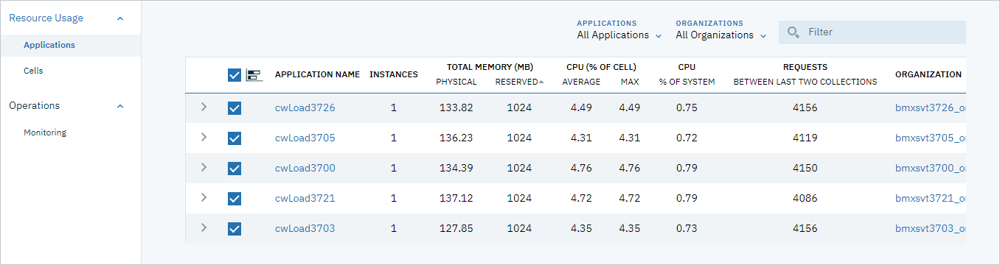

---

copyright:
  years: 2018
lastupdated: "2018-11-16"

---

{:shortdesc: .shortdesc}
{:new_window: target="_blank"}
{:codeblock: .codeblock}
{:pre: .pre}
{:screen: .screen}
{:tip: .tip}

# Problemi noti (limitazioni)
{: #known-issues}

## Instabilità a causa dell'elevato utilizzo di CPU da parte dell'esportatore Firehose Prometheus
{: #instabilityCPU-issue}

Gli ambienti CFEE includono un esportatore Prometheus Firehose per raccogliere le metriche di Cloud Foundry sulle richieste _start_ e _stop_ http e https. Un ambiente CFEE con un elevato numero di richieste http può portare l'esportatore Prometheus Firehose a utilizzare una grande quantità di CPU. Ciò può causare una certa instabilità nell'ambiente poiché il pod dell'esportatore Firehose viene eseguito su uno dei nodi di lavoro del piano di controllo Cloud Foundry.

Puoi determinare se il pod dell'esportatore Firehose sta utilizzando un'elevata quantità di CPU e, potenzialmente, causando instabilità nell'ambiente CFEE mediante uno dei seguenti metodi: 
1.  Controlla l'utilizzo complessivo della CPU del piano di controllo CF mediante la pagina di panoramica di CFEE per tale ambiente CFEE. Vedi un esempio illustrativo di utilizzo elevato della CPU qui di seguito:


2. Controlla l'utilizzo della CPU nella pagina _Utilizzo risorsa > Applicazioni_ e vedi se c'è un numero insolitamente elevato di richieste http. Vedi un esempio illustrativo di utilizzo elevato della CPU qui di seguito:


3. Controlla la console POD Grafana (avviata dalla pagina _Monitoraggio_) che mostra l'utilizzo della CPU per il pod Firehose. Vedi un esempio illustrativo di utilizzo elevato della CPU di seguito:


Se l'esportatore Firehose sta utilizzando tra lo 0,5 e lo 0,7 (50-70%) della CPU e la CPU complessiva del piano di controllo è elevata, potresti dover disattivare la raccolta delle metriche delle richieste http mediante la seguente procedura:

1. Crea il `config.yaml`:

   ```
   kubectl -n cf-monitoring get deployment firehose-exporter -f yaml > config.yaml
   ```
   {: pre}
  
2. Modifica il `config.yaml` e aggiungi la seguente riga nell'array `spec.template.spec.containers.args`:

   ```
   - --filter.events=ContainerMetric,CounterEvent,ValueMetric          
   ```
   {: pre}

### Esempio

`config.yam` modificato:

```
  ...
  template:
  ...
    spec:
      containers:
      - args:
        ...
        - --doppler.metric-expiration=10m
        - --metrics.environment=IBM-Cloud-Foundry-Enterprise-Environment
        - --filter.events=ContainerMetric,CounterEvent,ValueMetric
        image: boshprometheus/firehose-exporter
```  

Il seguente comando riconfigurerà e riavvierà il pod del nodo di lavoro:

```
kubectl -n cf-monitoring apply -f config.yaml

```
{: pre}

Per ulteriori informazioni sull'esportatore Firehose Prometheus, vedi [Cloud Foundry Firehose Prometheus exporter](https://github.com/bosh-prometheus/firehose_exporter){: new_window} .
