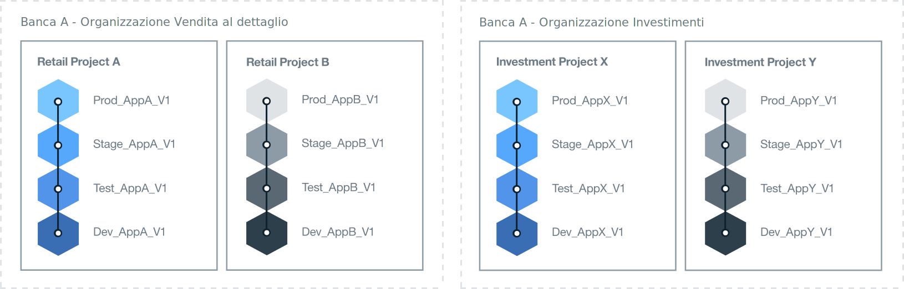

---

copyright:

  years: 2018
lastupdated: "2018-04-13"

---

{:shortdesc: .shortdesc}
{:new_window: target="_blank"}
{:codeblock: .codeblock}
{:pre: .pre}
{:screen: .screen}
{:tip: .tip}

# Determina l'architettura della tua organizzazione
{: #orgstructure}

Per progettare un ambiente che utilizza {{site.data.keyword.Bluemix_notm}} pubblico, {{site.data.keyword.Bluemix_dedicated_notm}}, {{site.data.keyword.Bluemix_local_notm}}, o qualsiasi loro combinazione, puoi utilizzare le seguenti architetture dell'organizzazione:

* Singola organizzazione: prendi in considerazione questa architettura se hai bisogno che la stessa serie di utenti acceda alle risorse disponibili in un qualsiasi punto dell'organizzazione.
* Più organizzazioni: prendi in considerazione questa architettura se hai bisogno dell'isolamento tra ambienti diversi.

## Singola organizzazione contro più organizzazioni
{: #singleormulti}

In un ambiente con una singola organizzazione, le risorse dell'infrastruttura sono condivise da aree differenti dell'azienda. Mentre, in un ambiente con più organizzazioni, le risorse dell'infrastruttura non sono condivise.

Entrambe le architetture dell'organizzazione supportano i seguenti principi:

* Applicazione dei limiti per le applicazioni, i progetti o entrambi.
* L'autorizzazione per gestire le risorse che sono concesse dal ruolo utente.

Puoi quindi definire più spazi basati su differenti linee di business (LOB), fasi di distribuzione, progetti specifici, applicazioni, autorizzazioni utente o una combinazione di questi componenti.

Per implementare un'architettura a più organizzazione puoi definire le organizzazioni che corrispondono a LOB diversi, fasi di consegna, progetti specifici, autorizzazioni utente o una combinazione di questi componenti. Puoi quindi definire più spazi che si basano su applicazioni o progetti forniti dallo stesso reparto nell'azienda.

{: tip}

## Considerazioni sull'organizzazione
{: #orgconsiderations}

Quando implementi un'architettura a singola organizzazione, questa include ogni risorsa cloud, servizio e applicazione da te utilizzati per sviluppare, gestire e distribuire le applicazioni cloud. In {{site.data.keyword.Bluemix_notm}} pubblico, l'organizzazione fornisce la separazione tra gli account ed è disponibile in tutte le regioni.

 

 Figura 1. Esempio di architettura a singola organizzazione.
{: #bpfigure1}

Quando implementi un'architettura a più organizzazioni, le organizzazioni forniscono il primo livello di applicazione di limiti e astrazione che puoi utilizzare per controllare e definire cosa può essere fatto e da chi. Progetta ogni organizzazione attorno a differenti LOB, fasi di distribuzione, progetti specifici o una combinazione di questi componenti.  

Il numero di organizzazioni necessarie dipende da più fattori:

* Il livello di granularità di cui hai bisogno all'interno della tua organizzazione per gestire le quote e controllare i costi.
* Il livello di sicurezza che devi applicare nei tuoi diversi ambienti. Ad esempio, se utilizzi dei contenitori, potresti voler separare le immagini del contenitore utilizzate per lo sviluppo da quelle utilizzate per la produzione.
* La posizione delle organizzazioni dovuta ai requisiti aziendali, del paese e del settore. Ad esempio, potresti voler eseguire tutte le tue applicazioni in un ambiente che si trova in una specifica regione della tua area geografica.

Quando definisci le diverse organizzazioni per la tua struttura cloud, tieni presenti le seguenti indicazioni:

* Definisci e quindi applica una convenzione di denominazione. Ad esempio, definisci una convenzione di denominazione in cui il nome dell'organizzazione include informazioni sull'area di business, sul tipo di cloud e sulla fase del processo (sviluppo, test o produzione). Per le organizzazioni che si trovano in {{site.data.keyword.Bluemix_notm}} pubblico, potresti anche aggiungere informazioni sulla regione.
* Definisci le restrizioni applicabili all'organizzazione. Ad esempio, definisci il ruolo dei membri del team che lavoreranno in tale organizzazione.
* Identifica il gestore dell'organizzazione.
* Identifica l'area di business assegnata a questa organizzazione.

I seguenti scenari mostrano i diversi approcci che puoi adottare per definire il numero di organizzazioni Cloud Foundry in un ambiente:

### Scenario 1: Separazione dei gruppi di utenti in base alla distribuzione delle applicazioni di business

 Descrizione: le regole aziendali richiedono che le applicazioni di ogni LOB siano sviluppate, gestite e distribuite dagli utenti di ciascuna LOB. È necessario applicare la sicurezza in modo che gli utenti possano accedere solo alle applicazioni pertinenti alla loro parte del business. Dunque, gli utenti lavorano in differenti aree di business, le applicazioni su cui stanno lavorando richiedono l'accesso alle diverse risorse {{site.data.keyword.Bluemix_notm}} e non vi è alcuna sovrapposizione di attività.

  Soluzione: puoi creare un'organizzazione per ogni processo di distribuzione delle applicazioni di business. Ad esempio, un'organizzazione per l'attività bancaria al dettaglio e una per l'attività di investimento.

  

  Figura 2. Esempio di architettura a più organizzazioni allineata alla distribuzione LOB
{: #bpfigure2}

### Scenario 2: Separazione in base al tipo di utenti (utenti interni e esterni)

  Descrizione: la tua azienda lavora con diversi partner e hai bisogno di stabilire dei chiari limiti tra gli utenti interni ed esterni.

  Soluzione: puoi creare un'organizzazione per distribuire le applicazioni utilizzate internamente. Inoltre, puoi creare un'organizzazione per ogni partner esterno.

### Scenario 3: Isolamento in base al progetto

  Descrizione: la tua azienda organizza degli hackathon per identificare nuovi servizi.  

  Soluzione: puoi definire un'organizzazione per ogni hackathon e utilizzare l'organizzazione come un sandbox. Dopo l'hackathon, puoi promuovere l'organizzazione sandbox in un'ulteriore organizzazione nel tuo account.

### Scenario 4: Isolamento di utenti in base alla fase di distribuzione

  Descrizione: un'azienda vuole che gli utenti di sviluppo, test e produzione collaborino in una distribuzione, ma il loro accesso è controllato dal ruolo utente e dall'esperienza lavorativa.

  Soluzione: puoi creare una singola organizzazione e definire uno spazio per ogni fase di distribuzione. Quindi, a seconda del ruolo utente e dell'esperienza lavorativa, concedi agli utenti l'accesso in lettura e scrittura richiesto per completare il loro lavoro e per collaborare all'interno dell'organizzazione.

  

   Figura 3. Esempio di architettura a singola organizzazione allineata alla fase di distribuzione
{: #bpfigure3}

## Denominazione, limitazioni e gestione dell'organizzazione
{: #orgadmin}   

Tieni conto delle seguenti indicazioni sull'organizzazione:

* Definisci e applica una convenzione di denominazione. Ad esempio, definisci una convenzione di denominazione in cui il nome dell'organizzazione include informazioni sull'area di business, sul tipo di cloud e sul ruolo IT (sviluppo, test o produzione). Per le organizzazioni che si trovano in {{site.data.keyword.Bluemix_notm}} pubblico, potresti anche aggiungere informazioni sulla regione. Puoi modificare il nome di un'organizzazione dopo che è stata creata. Se un nome organizzazione viene modificato, avvisa tutti i membri del team dell'organizzazione in merito alla modifica.
* Definisci le restrizioni applicabili all'organizzazione. Ad esempio, definisci il ruolo di ogni membro del team e le autorizzazioni necessarie per lavorare in tale organizzazione.
* Identifica il gestore dell'organizzazione. Potresti voler delegare l'amministrazione dell'organizzazione a più di una persona.
* Identifica l'area di business assegnata a questa organizzazione. L'utilizzo dell'applicazione generato in ciascuno spazio all'interno dell'organizzazione, viene accumulato e segnalato a livello dell'organizzazione.
