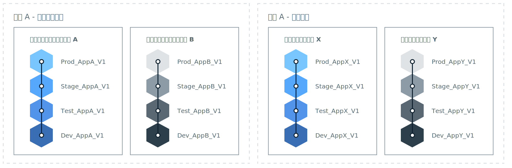

---

copyright:

  years: 2018
lastupdated: "2018-04-13"

---

{:shortdesc: .shortdesc}
{:new_window: target="_blank"}
{:codeblock: .codeblock}
{:pre: .pre}
{:screen: .screen}
{:tip: .tip}

# 組織体系の決定
{: #orgstructure}

{{site.data.keyword.Bluemix_notm}} Public、{{site.data.keyword.Bluemix_dedicated_notm}}、{{site.data.keyword.Bluemix_local_notm}}、またはその任意の組み合わせを使用する環境を設計するには、次の組織体系を使用できます。

* 単一組織:: 同じユーザー集合が、組織内のすべての場所で使用可能なリソースにアクセスする必要がある場合は、この体系の使用を検討してください。
* 複数組織: 異なる環境間で独立性が必要な場合は、この体系を検討してください。

## 単一組織と複数組織の対比
{: #singleormulti}

単一組織環境では、会社のさまざまなエリアでインフラストラクチャー・リソースが共有されます。
一方、複数組織環境で、インフラストラクチャー・リソースは共有されません。

どちらの組織体系も、次の原則をサポートします。

* アプリケーションまたはプロジェクト、あるいはその両方に関する境界の適用。
* ユーザー役割で付与されたリソースを管理する許可。

その後、さまざまな基幹業務 (LOB)、デリバリー・フェーズ、特定のプロジェクト、アプリ、ユーザー許可、あるいはこれらのコンポーネントの組み合わせに基づいて複数のスペースを定義することができます。

複数組織体系を実装するには、さまざまな LOB、デリバリー・フェーズ、特定のプロジェクト、ユーザー許可、あるいはこれらのコンポーネントの組み合わせに対応した組織を定義できます。その後、会社内の同じ部門によってデリバリーされるアプリまたはプロジェクトに基づいて複数のスペースを定義することができます。

{: tip}

## 組織の考慮事項
{: #orgconsiderations}

単一組織体系を実装すると、クラウド・アプリの開発、管理、デプロイに使用するクラウドのリソース、サービス、アプリがすべて、その組織に含まれます。{{site.data.keyword.Bluemix_notm}} Public では、組織はアカウント間の分離を提供し、すべての地域から使用可能になります。

 

 図 1. 単一組織体系の例。
{: #bpfigure1}

複数組織体系を実装すると、実行内容と実行者の制御および定義に使用できる、第 1 レベルの境界適用と抽象化が組織によって提供されます。
さまざまな LOB、デリバリー・フェーズ、ユーザーの役割、特定プロジェクト、あるいはこれらのコンポーネントの組み合わせに基づいて各組織を設計します。  

必要な組織の数は、次のような複数の要因に依存します。

* 割り当て量管理およびコスト制御のために組織内で必要な細分度。
* 異なる環境で適用が必要なセキュリティーのレベル。例えば、コンテナーを使用する場合に、実動に使用されるコンテナー・イメージから、開発に使用されるコンテナー・イメージを分離することがあります。
* 企業、国、業界の要件を理由とする組織のロケーション。例えば、管轄地域の中でも特定の地域にある環境ですべてのアプリを実行する必要があることがあります。

クラウド構造にさまざまな組織を定義する際には、以下のガイダンスを考慮してください。

* 命名規則を定義して適用します。例えば、ビジネス・エリア、クラウドのタイプ、プロセス・フェーズ (開発、テスト、実動) に関する情報を組織名に含めるという命名規則を定義します。{{site.data.keyword.Bluemix_notm}} Public にある組織では、地域に関する情報も追加することをお勧めします。
* 組織に適用される制約事項を定義します。例えば、その組織で働くチーム・メンバーの役割を定義します。
* 組織の管理者を特定します。
* この組織に割り振られたビジネス・エリアを特定します。

以下のシナリオでは、環境で Cloud Foundry 組織の数を定義する際に採用できるさまざまなアプローチを示します。

### シナリオ 1: ビジネス・アプリケーション・デリバリーによるユーザー・グループの分離

 説明: 各 LOB のアプリが、各 LOB のユーザーによって開発、管理、デプロイされる必要があると、企業規則で要求されます。ユーザーが自分の業務に関連するアプリのみにアクセス可能になるよう、セキュリティーが適用される必要があります。ユーザーはさまざまなビジネス・エリアで働き、使用するアプリではさまざまな {{site.data.keyword.Bluemix_notm}} リソースへのアクセスが必要で、重なり合うアクティビティーはありません。

  解決策: ビジネス・アプリケーション・デリバリー・プロセスごとに 1 つの組織を作成します。例えば、リテール・バンキング用の組織、投資バンキング用の組織などです。

  

  図 2. LOB デリバリーに調整した複数組織体系の例
{: #bpfigure2}

### シナリオ 2: ユーザーのタイプ (内部ユーザー、外部ユーザー) に基づく分離

  説明: 会社がさまざまなパートナーと協働しており、内部ユーザーと外部ユーザー間の明確な境界が必要です。

  解決策: 内部的に使用されるアプリをデリバリーするための組織を作成します。さらに、外部パートナーごとに 1 つの組織を作成できます。

### シナリオ 3: プロジェクトによる分離

  説明: 新しいサービスを見出すために会社がハッカソンを実施します。  

  解決策: ハッカソンごとに 1 つの組織を定義し、組織をサンドボックスとして使用します。ハッカソンの後、そのサンドボックス組織をアカウントの追加組織にプロモートすることができます。

### シナリオ 4: デリバリー・フェーズによるユーザーの分離

  説明: 開発、テスト、実動の各ユーザーがデリバリー全体でコラボレーションすることを会社は望んでいますが、アクセス権限は、ユーザーの役割と仕事の経験で制御されています。

  解決策: 単一組織を作成して、デリバリー・フェーズごとに 1 つのスペースを定義します。その後、ユーザーの役割と仕事の経験に応じて、作業の遂行と組織内のコラボレーションに必要な読み取りおよび書き込みのアクセス権限を付与します。

  

   図 3. デリバリー・フェーズによって調整された単一組織体系の例
{: #bpfigure3}

## 組織の命名、制約事項、および管理
{: #orgadmin}   

組織に関する以下のガイダンスを考慮してください。

* 命名規則を定義して適用します。例えば、ビジネス・エリア、クラウドのタイプ、IT 役割 (開発、テスト、実動) に関する情報を組織名に含めるという命名規則を定義します。{{site.data.keyword.Bluemix_notm}} Public にある組織では、地域に関する情報も追加することをお勧めします。組織名は、作成後に変更可能です。組織名が変更されたら、すべての組織チーム・メンバーにその変更を通知してください。
* 組織に適用される制約事項を定義します。例えば、各チーム・メンバーの役割と、その組織での作業に必要な許可を定義します。
* 組織の管理者を特定します。複数のユーザーに組織管理を委任すると有効です。
* この組織に割り振られたビジネス・エリアを特定します。組織内での各スペースで発生したアプリケーション使用は、組織レベルで集計されて報告されます。
