---

copyright:

  years: 2018
lastupdated: "2018-04-13"

---

{:shortdesc: .shortdesc}
{:new_window: target="_blank"}
{:codeblock: .codeblock}
{:pre: .pre}
{:screen: .screen}
{:tip: .tip}

# 조직 아키텍처 판별
{: #orgstructure}

{{site.data.keyword.Bluemix_notm}} 퍼블릭, {{site.data.keyword.Bluemix_dedicated_notm}}, {{site.data.keyword.Bluemix_local_notm}} 또는 임의의 조합을 사용하는 환경을 디자인하기 위해 다음 조직 아키텍처를 사용할 수 있습니다.

* 단일 조직: 조직의 임의의 위치에서 사용 가능한 리소스에 액세스하기 위해 동일한 사용자 세트가 필요한 경우에는 이 아키텍처를 고려하십시오.
* 다중 조직: 서로 다른 환경 간에 격리가 필요한 경우에는 이 아키텍처를 고려하십시오.

## 단일 조직 대 다중 조직
{: #singleormulti}

단일 조직 환경에서는 인프라 리소스가 회사의 여러 영역에서 공유됩니다. 반면에 다중 조직 환경에서는 인프라 리소스가 공유되지 않습니다.

두 조직 아키텍처 모두 다음 원칙을 지원합니다.

* 앱, 프로젝트 또는 둘 다에 대한 경계 적용
* 사용자 역할에 따라 부여된 리소스를 관리할 수 있는 권한

그런 다음, 다른 비즈니스 라인(LOB) 또는 전달 단계, 특정 프로젝트, 앱, 사용자 권한 또는 이러한 컴포넌트의 조합을 기반으로 하는 여러 영역을 정의할 수 있습니다.

다중 조직 아키텍처를 구현하기 위해 다른 LOB, 전달 단계, 특정 프로젝트, 사용자 권한 또는 이러한 컴포넌트의 조합에 해당하는 조직을 정의할 수 있습니다. 그런 다음, 회사의 동일한 부서에서 전달하는 앱 또는 프로젝트를 기반으로 하는 여러 영역을 정의할 수 있습니다.

{: tip}

## 조직 고려사항
{: #orgconsiderations}

단일 조직 아키텍처를 구현하는 경우 클라우드 앱을 개발, 관리 및 배치하는 데 사용하는 모든 클라우드 리소스, 서비스 및 앱이 조직에 포함됩니다. {{site.data.keyword.Bluemix_notm}} 퍼블릭에서 조직은 계정 간 분리를 제공하고 모든 지역에서 사용 가능합니다.

 

 그림 1. 단일 조직 아키텍처의 예
{: #bpfigure1}

다중 조직 아키텍처를 구현하는 경우 조직은 수행할 수 있는 작업 및 수행하는 사용자를 제어하고 정의하는 데 사용할 수 있는 첫 번째 레벨의 경계 적용 및 추출을 제공합니다. 다른 LOB, 전달 단계, 사용자의 역할, 특정 프로젝트 또는 이러한 컴포넌트의 조합에 맞게 각 조직을 디자인하십시오.  

필요한 조직 수는 다음 요인에 따라 다릅니다.

* 할당량 및 제어 비용을 관리하기 위해 조직 내에 필요한 단위 레벨입니다.
* 여러 환경에 적용해야 하는 보안 레벨입니다. 예를 들어, 컨테이너를 사용하는 경우 프로덕션에 사용되는 컨테이너 이미지에서 개발을 위해 사용되는 컨테이너 이미지를 분리할 수 있습니다.
* 회사, 국가 및 업계 요구사항으로 인한 조직의 위치입니다. 예를 들어, 해당 지역(geo)의 특정 지역에 있는 환경에서 모든 앱을 실행할 수 있습니다.

클라우드 구조에 맞게 여러 조직을 정의하는 경우 다음 지침을 고려하십시오.

* 이름 지정 규칙을 정의한 다음 적용하십시오. 예를 들어, 조직의 이름에 비즈니스 영역, 클라우드의 유형 및 프로세스 단계(개발, 테스트 또는 프로덕션)에 대한 정보가 포함된 이름 지정 규칙을 정의하십시오. {{site.data.keyword.Bluemix_notm}} 퍼블릭에 있는 조직의 경우 지역에 대한 정보도 추가할 수 있습니다.
* 조직에 적용되는 제한사항을 정의하십시오. 예를 들어, 해당 조직에서 작업할 팀 구성원의 역할을 정의하십시오.
* 조직의 관리자를 식별하십시오.
* 이 조직에 할당된 비즈니스의 영역을 식별하십시오.

다음 시나리오는 환경에서 Cloud Foundry 조직의 수를 정의할 때 채택할 수 있는 다양한 접근 방법을 보여줍니다.

### 시나리오 1: 비즈니스 애플리케이션 전달에 따라 사용자 그룹 분리

 설명: 회사 규칙에 따라 각 LOB의 사용자가 각 LOB의 앱을 개발, 관리 및 배치해야 합니다. 사용자가 비즈니스의 해당 파트와 관련된 앱에만 액세스할 수 있도록 보안을 적용해야 합니다. 따라서 사용자는 서로 다른 비즈니스 영역에서 작업하고, 작업 중인 앱에 서로 다른 {{site.data.keyword.Bluemix_notm}} 리소스에 대한 액세스 권한이 필요하며, 활동이 겹치지 않습니다.

  솔루션: 각 비즈니스 애플리케이션 전달 프로세스에 대한 조직을 작성할 수 있습니다. 예를 들어, 소매 은행업무를 위한 하나의 조직과 투자 은행업무를 위한 하나의 조직이 있습니다.

  

  그림 2. LOB 전달에 맞춘 다중 조직 아키텍처의 예
{: #bpfigure2}

### 시나리오 2: 사용자 유형(내부 사용자, 외부 사용자)에 따라 분리

  설명: 회사에서는 여러 파트너와 함께 작업하며 내부 사용자와 외부 사용자 간에 분명한 경계가 필요합니다.

  솔루션: 내부적으로 사용되는 앱을 전달하기 위해 조직을 작성할 수 있습니다. 또한 각 외부 파트너에 대해 하나의 조직을 작성할 수 있습니다.

### 시나리오 3: 프로젝트에 따라 격리

  설명: 회사에서 해커톤(Hackathon)을 실행하여 새 서비스를 식별합니다.  

  솔루션: 해커톤(Hackathon)마다 하나의 조직을 정의하고 조직을 샌드박스로 사용할 수 있습니다. 해커톤(Hackathon) 다음에 샌드박스 조직을 사용자 계정의 추가 조직으로 승격시킬 수 있습니다.

### 시나리오 4: 전달 단계에 따라 사용자 격리

  설명: 회사에서는 개발, 테스트, 프로덕션 사용자가 전달 시 협업하기를 원하지만 해당 액세스는 사용자 역할 및 작업 환경을 통해 제어됩니다.

  솔루션: 단일 조직을 작성하고 각 전달 단계에 대한 영역을 정의할 수 있습니다. 그런 다음, 사용자 역할 및 작업 환경에 따라 해당 작업을 완료하고 조직 내에서 협업하는 데 필요한 읽기 및 쓰기 액세스를 부여하십시오.

  

   그림 3. 전달 단계에 따른 단일 조직 아키텍처의 예
{: #bpfigure3}

## 조직 이름 지정, 제한사항, 관리
{: #orgadmin}   

다음 조직 지침을 고려하십시오.

* 이름 지정 규칙을 정의하고 적용하십시오. 예를 들어, 조직의 이름에 비즈니스 영역, 클라우드의 유형 및 IT 역할(개발, 테스트 또는 프로덕션)에 대한 정보가 포함된 이름 지정 규칙을 정의하십시오. {{site.data.keyword.Bluemix_notm}} 퍼블릭에 있는 조직의 경우 지역에 대한 정보도 추가할 수 있습니다. 조직 이름 작성 후 변경할 수 있습니다. 조직 이름이 변경되면 모든 조직 팀 구성원에게 변경에 대해 알리십시오.
* 조직에 적용되는 제한사항을 정의하십시오. 예를 들어, 각 팀 구성원의 역할 및 해당 조직에서 작업하는 데 필요한 권한을 정의하십시오.
* 조직의 관리자를 식별하십시오. 둘 이상의 사용자에게 조직 관리를 위임할 수 있습니다.
* 이 조직에 할당된 비즈니스의 영역을 식별하십시오. 조직 내 각 영역에 생성된 애플리케이션 사용량은 조직 레벨에서 누적되고 보고됩니다.
