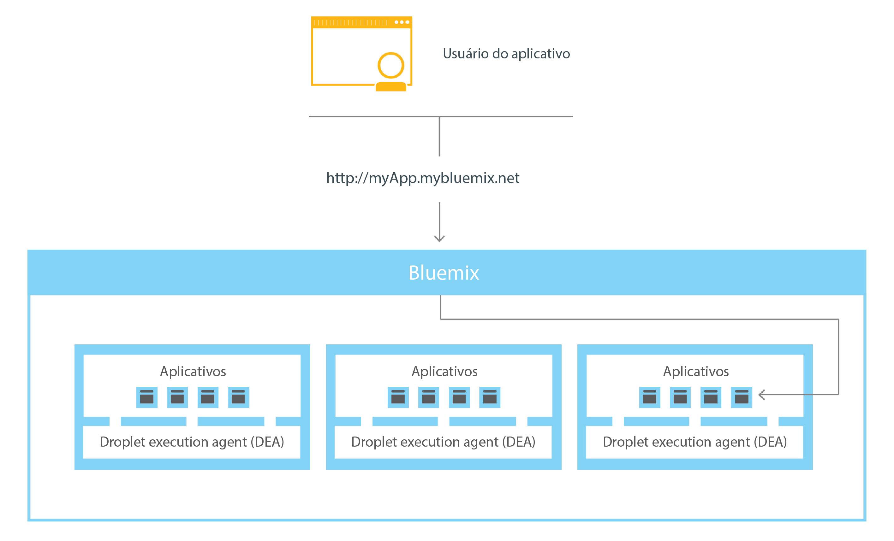
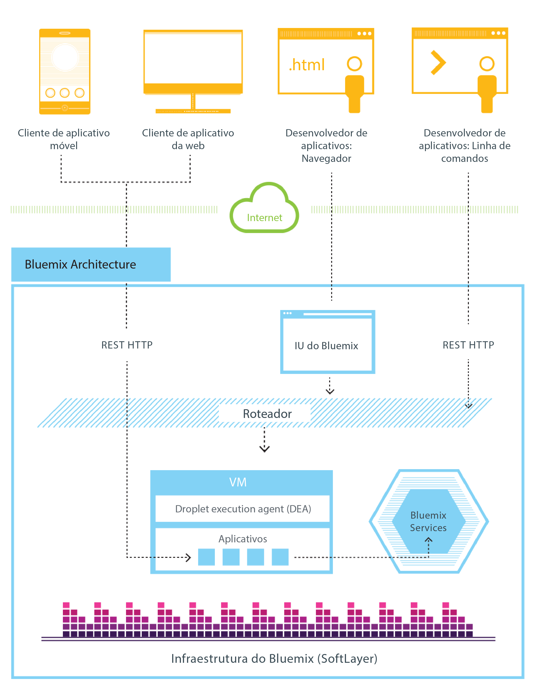
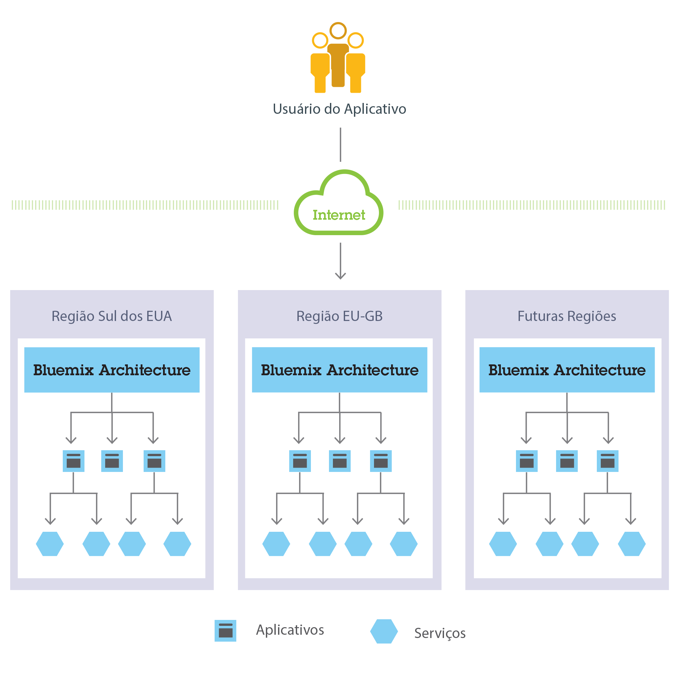

---


copyright:
  years: 2016, 2018
lastupdated: "2018-01-16"

---

{:shortdesc: .shortdesc}
{:new_window: target="_blank"}

# Como o Cloud Foundry funciona com o {{site.data.keyword.cloud_notm}}
{: #howwork}

Ao implementar um app no Cloud Foundry, deve-se configurar o {{site.data.keyword.cloud_notm}} com informações suficientes para suportar o app.

* Para um app móvel, o {{site.data.keyword.cloud_notm}} contém um artefato que representa o backend do app móvel, tal como os serviços que o app móvel usa para se comunicar com um servidor.
* Para um app da web, deve-se assegurar que as informações sobre o tempo de execução e a estrutura sejam comunicadas ao {{site.data.keyword.cloud_notm}}, para que o {{site.data.keyword.cloud_notm}} possa configurar o
ambiente de execução adequado para executar o app.

Cada ambiente de execução, incluindo o ambiente móvel e
o ambiente da web, é isolado do ambiente de execução de outros apps. Os ambientes de execução são isolados embora esses apps estejam
na mesma máquina física. A figura a seguir mostra o fluxo básico de como Cloud Foundry gerencia a implementação de apps no {{site.data.keyword.cloud_notm}}:


Figura 1. Implementando um app

Quando você cria um app e o implementa no Cloud Foundry, o ambiente {{site.data.keyword.cloud_notm}} determina um servidor virtual apropriado para o qual enviar o app ou os artefatos que o app representa. Para um aplicativo móvel, uma projeção de backend móvel é criada no {{site.data.keyword.cloud_notm}}. Qualquer código para o app móvel em execução na nuvem finalmente é executado
no ambiente do {{site.data.keyword.cloud_notm}}. Para um app da web, o código em execução na nuvem é o próprio app que o desenvolvedor implementa no {{site.data.keyword.cloud_notm}}. A determinação do servidor virtual é baseada em vários fatores, incluindo:

* A carga que já está na máquina
* Tempos de execução ou estruturas suportados por esse servidor virtual.

Após um servidor virtual ser escolhido, um gerente de aplicativos em cada servidor virtual instala a estrutura e o tempo de execução apropriados para o aplicativo. Em seguida, o app pode ser implementado nessa estrutura. Quando a implementação é concluída, os artefatos de aplicativo são iniciados.

A figura a seguir mostra a estrutura de um servidor virtual, também conhecida como Droplet Execution Agent (DEA), que possui vários apps implementados nele:


Figura 2. Design de um servidor virtual

Em cada servidor virtual, um gerente de aplicativos se comunica com o restante da infraestrutura do {{site.data.keyword.cloud_notm}} e gerencia os apps implementados nesse servidor virtual. Cada servidor virtual possui contêineres para separar e proteger os apps. Em cada contêiner, o {{site.data.keyword.cloud_notm}} instala
a estrutura e o tempo de execução apropriados necessários para cada app.

Quando o app for implementado, se ele tiver uma interface da web
(como um app da web Java) ou outros serviços baseados em REST (como
serviços móveis expostos publicamente para o app móvel), os usuários do app poderão se comunicar com ele usando solicitações normais de HTTP.



Figura 3. Chamando um app {{site.data.keyword.cloud_notm}}

Cada app pode ter uma ou mais URLs associadas a ele, mas todas elas devem apontar para o terminal do {{site.data.keyword.cloud_notm}}. Quando uma solicitação entra, o {{site.data.keyword.cloud_notm}} a examina, determina para qual app ela se destina e, em seguida, seleciona uma instância do app para recebê-la.


## Arquitetura Cloud Foundry no {{site.data.keyword.cloud_notm}}
{: #architecture}

Em geral, você não precisa se preocupar com o sistema operacional e as camadas de infraestrutura ao executar apps no {{site.data.keyword.cloud_notm}} no Cloud Foundry. Camadas
como sistemas de arquivos raiz e componentes de middleware são abstraídas para que você possa focar em seu
código do aplicativo. No entanto, é possível saber mais sobre estas camadas se precisar de informações específicas sobre onde seu
app está sendo executado.

Consulte [Visualizando camadas de infraestrutura do {{site.data.keyword.cloud_notm}}](cf.html#infralayers) para obter detalhes.

Como desenvolvedor, é possível interagir com a infraestrutura do {{site.data.keyword.cloud_notm}},
usando uma interface com o usuário baseada no navegador. Também é possível usar uma interface de linha de comandos Cloud Foundry, chamada cf, para implementar apps da web.

Os clientes, que podem ser apps móveis, apps executados externamente, apps que são construídos no {{site.data.keyword.cloud_notm}} ou desenvolvedores que
estão usando navegadores, interagem com os aplicativos hospedados no {{site.data.keyword.cloud_notm}}. Os clientes usam APIs de REST ou HTTP para rotear solicitações por meio do {{site.data.keyword.cloud_notm}} para
uma das instâncias do app ou para os serviços compostos.

A figura a seguir mostra a arquitetura de alto nível do Cloud Foundry no {{site.data.keyword.cloud_notm}}.



Figura 4. Arquitetura Cloud Foundry no {{site.data.keyword.cloud_notm}}

É possível implementar seus apps em diferentes regiões do {{site.data.keyword.cloud_notm}}, para considerações de latência ou segurança. É possível optar por implementar para uma região ou entre várias regiões.




Figura 5. Implementação do aplicativo multiregion

Camadas de infraestrutura do {{site.data.keyword.Bluemix_notm}}
{: #infralayers}


O {{site.data.keyword.Bluemix_notm}} abstrai e oculta
camadas do sistema operacional e da infraestrutura, para que você não precise gerenciá-las. No entanto, às vezes
você pode desejar saber mais sobre o sistema operacional e o middleware para seu app.
{:shortdesc}

### Visualizando camadas de infraestrutura do {{site.data.keyword.Bluemix_notm}}
{: #viewinfra}

É possível executar o comando **bluemix app stacks** para mostrar as pilhas disponíveis ou os sistemas de arquivos raiz nos quais seus apps devem ser implementados. Também é possível especificar a pilha ao usar o comando **bluemix app push** com a opção *-s* e o *stack_name*, em que o stack_name é o sistema de arquivos raiz, como `lucid64` ou `cflinuxfs2`:

```
bluemix app push appName -s stack_name
```

É possível usar o comando `cf buildpacks` para mostrar os componentes de middleware, como o perfil WebSphere Liberty e o SDK para Node.js, que estão disponíveis como tempos de execução para seu app ser executado. E você pode especificar o ambiente de tempo de execução para seu app usando o comando a seguir:

```
bluemix app push appName -b buildpackname
```
