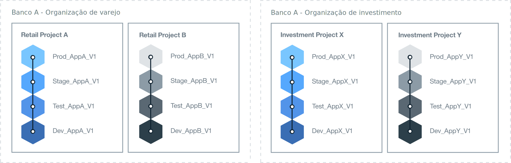

---

copyright:

  years: 2018
lastupdated: "2018-04-13"

---

{:shortdesc: .shortdesc}
{:new_window: target="_blank"}
{:codeblock: .codeblock}
{:pre: .pre}
{:screen: .screen}
{:tip: .tip}

# Determinar Arquitetura da Organização
{: #orgstructure}

Para projetar um ambiente que use o {{site.data.keyword.Bluemix_notm}} Public, {{site.data.keyword.Bluemix_dedicated_notm}}, {{site.data.keyword.Bluemix_local_notm}} ou qualquer combinação, é possível usar as arquiteturas de organização a seguir:

* Organização única: considere essa arquitetura se você requer que o mesmo conjunto de usuários acesse recursos que estão disponíveis em qualquer lugar da organização.
* Organização múltipla: considere essa arquitetura se você requer isolamento entre ambientes diferentes.

## Single-organization versus multi-organization
{: #singleormulti}

Em um ambiente de organização única, os recursos de infraestrutura são compartilhados por diferentes áreas da
empresa. Por outro lado, em um ambiente de organização múltipla, os recursos de infraestrutura não são compartilhados.

Ambas as arquiteturas de organização suportam os princípios a seguir:

* Cumprimento de limite para apps, projetos ou ambos.
* Autorização para gerenciar recursos que são concedidos pela função de usuário.

Em seguida, é possível definir múltiplos espaços que são baseados em diferentes linhas de negócios (LOB), fases de entrega, projetos específicos, apps, permissões de usuário ou uma combinação desses componentes.

Para implementar uma arquitetura de organização múltipla, é possível definir organizações que correspondam a diferentes LOBs, fases de entrega, projetos específicos, permissões de usuário ou uma combinação desses componentes. É possível, então, definir múltiplos espaços que são baseados em apps ou projetos que são entregues pelo mesmo departamento na empresa.

{: tip}

## Considerações da Organização
{: #orgconsiderations}

Ao implementar uma arquitetura de organização única, a organização inclui todos os recursos, serviços e apps em nuvem que você usa para desenvolver, gerenciar e implementar apps em nuvem. No {{site.data.keyword.Bluemix_notm}} Public, a organização fornece segregação entre contas e está disponível em todas as regiões.

 

 Figura 1. Exemplo de uma arquitetura de organização única.
{: #bpfigure1}

Ao implementar uma arquitetura de organização múltipla, as organizações fornecem o primeiro nível de cumprimento de limite e abstração que é possível usar para controlar e definir o que pode ser
feito e por quem. Projete cada organização em torno dos diferentes LOBs, as fases de entrega, as funções dos usuários, projetos específicos ou uma combinação desses componentes.  

O número de organizações requeridas depende de múltiplos fatores:

* O nível de granularidade requerido dentro da organização para gerenciar cotas e custos de controle.
* O nível de segurança que deve-se impingir nos diferentes ambientes. Por exemplo, se você estiver usando contêineres, talvez deseje segregar as imagens de contêineres que são usadas para desenvolvimento das imagens de contêineres que são usadas para produção.
* O local das organizações devido aos requisitos do país, da indústria e corporativos. Por exemplo, você pode desejar executar todos os apps em um ambiente que está localizado em uma região específica em sua geografia (geo).

Quando você estiver definindo as diferentes organizações para sua estrutura em nuvem, considere a orientação a seguir:

* Defina e, em seguida, impinja uma convenção de nomenclatura. Por exemplo, defina uma convenção de nomenclatura na qual o nome da organização inclua informações sobre a área de negócios, o tipo de nuvem e a fase do processo (desenvolvimento, teste ou produção). Para organizações que estão localizadas no {{site.data.keyword.Bluemix_notm}} Public, você talvez deseje incluir informações sobre a região também.
* Defina as restrições que se aplicam à organização. Por exemplo, defina a função dos membros da equipe que vão trabalhar nessa organização.
* Identifique o gerente da organização.
* Identifique a área do negócio que está alocada para essa organização.

Os cenários a seguir mostram abordagens diferentes que podem ser adotadas ao definir o número de organizações do Cloud Foundry em um ambiente:

### Cenário 1: segregação de grupos de usuários por entrega de aplicativo de negócios

 Descrição: as regras corporativas requerem que os apps de cada LOB sejam desenvolvidos, gerenciados e implementados por usuários de cada LOB. A segurança deve ser impingida para que os usuários possam acessar somente os apps que são relevantes para sua parte do negócio. Portanto, os usuários trabalham em áreas de negócios diferentes, os apps nos quais eles estão trabalhando requerem acesso a diferentes recursos do {{site.data.keyword.Bluemix_notm}} e não há sobreposição de atividade.

  Solução: é possível criar uma organização para cada processo de entrega de aplicativo de negócios. Por exemplo, uma organização para financeiro de varejo e uma para financeiro de investimento.

  

  Figura 2. Exemplo de uma arquitetura de organização múltipla que está alinhada à entrega de LOB
{: #bpfigure2}

### Cenário 2: segregação com base nos tipos de usuários (usuários internos, usuários externos)

  Descrição: sua empresa trabalha com diferentes parceiros e você requer limites claros entre usuários internos e externos.

  Solução: é possível criar uma organização para entregar apps que são usados internamente. Além disso, é possível criar uma organização para cada parceiro externo.

### Cenário 3: isolamento por projeto

  Descrição: sua empresa executa hackathons para identificar novos serviços.  

  Solução: é possível definir uma organização por hackathon e usar a organização como um ambiente de simulação. Após o hackathon, é possível promover a organização do ambiente de simulação em uma organização extra em sua conta.

### Cenário 4: isolamento de usuários por fase de entrega

  Descrição: uma empresa deseja que os usuários de desenvolvimento, teste e produção colaborem em uma entrega, mas seus acessos são controlados por função de usuário e experiência de cargo.

  Solução: é possível criar uma organização única e definir um espaço para cada fase de entrega. Em seguida, dependendo da função de usuário e da experiência do cargo, conceda o acesso de leitura e gravação que eles requerem para concluir o seu trabalho e também colaborar dentro da organização.

  

   Figura 3. Exemplo de uma arquitetura de organização única que é alinhada por fase de entrega
{: #bpfigure3}

## Nomenclatura, restrições e gerenciamento da organização
{: #orgadmin}   

Considere a orientação da organização a seguir:

* Definir e impingir uma convenção de nomenclatura. Por exemplo, defina uma convenção de nomenclatura na qual o nome da organização inclua informações sobre a área de negócios, o tipo de nuvem e a função de TI (desenvolvimento, teste ou produção). Para organizações que estão localizadas no {{site.data.keyword.Bluemix_notm}} Public, você talvez deseje incluir informações sobre a região também. É possível mudar o nome de uma organização após sua criação. Se um nome da organização for alterado, notifique todos os membros da equipe da organização sobre a mudança.
* Defina as restrições que se aplicam à organização. Por exemplo, defina a função de cada um dos membros da equipe e as permissões que eles precisam para trabalhar nessa organização.
* Identifique o gerente da organização. Você talvez deseje delegar a administração da organização para mais que uma pessoa.
* Identifique a área do negócio que está alocada para essa organização. O uso de aplicativo que é gerado em cada um dos espaços, dentro da organização, é acumulado e relatado no nível de organização.
