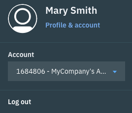

---

copyright:
  years: 2018
lastupdated: "2018-07-17"

---

{:shortdesc: .shortdesc}
{:new_window: target="_blank"}
{:codeblock: .codeblock}
{:pre: .pre}
{:screen: .screen}
{:tip: .tip}

# Preparando sua Conta
{: #prepare}

As instâncias do CFEE são implementadas em recursos de infraestrutura (os nós do trabalhador do Kubernetes do serviço IBM Container) que são faturados para a conta do IBM Cloud. Isso significa que a conta do IBM Cloud sob a qual a instância do CFEE é criada deve ser uma conta paga (uma conta Pré-paga ou de Assinatura).  Se a conta do IBM Cloud sob a qual você pretende criar uma instância do CFEE for uma conta para teste, será solicitado que você faça upgrade da conta quando tentar criar uma instância do CFEE.  Quando uma conta do IBM Cloud é submetida a upgrade (de uma conta para teste para uma conta Pré-paga ou de Assinatura), a conta do IBM Cloud se torna vinculada a uma conta do SoftLayer (por meio da qual os recursos de infraestrutura podem ser criados). Para obter mais informações, consulte  [ Tipos de conta ](https://console.bluemix.net/docs/account/index.html#accounts). O custo desses recursos de infraestrutura é mostrado em sua fatura do IBM Cloud.

## Como determinar se a conta do IBM Cloud pode criar instâncias do CFEE
{: #account-check}

É possível determinar se uma conta do IBM Cloud é uma conta para teste ou paga e se ela está vinculada a uma conta do SoftLayer, verificando as informações de conta no canto superior direito do banner do IBM Cloud.

No exemplo abaixo, a usuária _Mary Smith_ efetuou login na conta do IBM Cloud _MyCompany_, que é uma conta para teste.

No exemplo abaixo, a mesma conta do IBM Cloud _MyCompany_ foi submetida a upgrade para uma conta paga.  Como resultado do upgrade, a conta agora está vinculada à conta do SoftLayer _1684806_.  Ambas as contas são mostradas no campo "Conta".

Se a conta do IBM Cloud for uma conta para teste, você será solicitado a fazer upgrade dela quando tentar criar uma instância do CFEE. Consulte a tela mostrada abaixo:

## Usando uma conta do SoftLayer em vez de fazer upgrade da conta do IBM Cloud
{: #account-linkswitching}

Se você tiver a função de Administrador em uma conta do IBM Cloud, será possível usar uma conta do SoftLayer para criar a instância do CFEE sem fazer upgrade da conta do IBM Cloud.

**Aviso:** se você usar uma conta do SoftLayer agora e atualizar a conta do IBM Cloud no futuro (para uma conta Pré-paga ou de Assinatura), o IBM Cloud atualizado poderá ainda usar a conta do Softlayer (cujas credenciais você configura agora) ao criar futuros recursos de infraestrutura. Além disso, se você usar uma conta do SofLayer diferente no futuro para criar Cloud Foundry Enterprise Environments, os usuários na conta do IBM Cloud poderão não ser capazes de acessar os recursos de infraestrutura criados na conta do SoftLayer cujas credenciais você configurou agora. Recomendamos fazer o upgrade da conta do IBM Cloud no lugar.

Para usar uma conta do SoftLayer sem fazer upgrade da conta do IBM Cloud (veja a tela abaixo para ilustração):
1. Na tela mostrada quando a conta do IBM Cloud não é submetida a upgrade, clique em **Usar uma conta do SoftLayer**.
2. Insira o **Nome do usuário** e a **Chave API** de uma conta do SoftLayer. Para obter o Nome do usuário do SoftLayer e a chave API, acesse o [console da SoftLayer](https://control.softlayer.com). Depois de efetuar login no SoftLayer, selecione a conta que você deseja vincular à conta do {{site.data.keyword.Bluemix_notm}}. Selecionar a conta abre a página do perfil da conta. Role para baixo até o término da página para localizar o nome do usuário da conta e a chave API. Se não tiver uma chave API, será possível gerá-la se você for o proprietário da conta. Se você não for o proprietário da conta, solicite ao proprietário da conta para gerá-la.
3. Clique em  ** Configurar Credenciais **.

**Nota:** deve-se ter permissões suficientes na conta do SoftLayer para criar um cluster regular do Kubernetes por meio do serviço IBM Container. Se não tiver, peça ao administrador da conta do SoftLayer ou ao usuário que lhe deu acesso à conta do SoftLayer para conceder a você essas permissões adicionais.
