---

copyright:

  years: 2018
lastupdated: "2018-04-13"

---

{:shortdesc: .shortdesc}
{:new_window: target="_blank"}
{:codeblock: .codeblock}
{:pre: .pre}
{:screen: .screen}
{:tip: .tip}

# 确定组织体系结构
{: #orgstructure}

要设计使用 {{site.data.keyword.Bluemix_notm}} Public、{{site.data.keyword.Bluemix_dedicated_notm}}、{{site.data.keyword.Bluemix_local_notm}} 或上述各项任意组合的环境，可以使用以下组织体系结构：

* 单组织：如果需要同一组用户来访问在组织中任何位置提供的资源，请考虑使用此体系结构。
* 多组织：如果需要隔离不同的环境，请考虑使用此体系结构。

## 单组织相较于多组织
{: #singleormulti}

在单组织环境中，基础架构资源由公司的不同领域共享。而在多组织环境中，基础架构资源并不共享。

这两种组织体系结构都支持以下原则：

* 对应用程序和/或项目强制实施边界。
* 按用户角色授予管理资源的权限。

然后，可以基于不同的业务线 (LOB)、交付阶段、特定项目、应用程序、用户许可权或以上各项的组合来定义多个空间。

要实施多组织体系结构，可为不同的 LOB、交付阶段、特定项目、用户许可权或以上各项的组合定义对应的组织。随后，可以基于公司中同一部门交付的应用程序或项目来定义多个空间。

{: tip}

## 组织注意事项
{: #orgconsiderations}

实施单组织体系结构时，该组织会包含用于开发、管理和部署云应用程序的所有云资源、服务和应用程序。在 {{site.data.keyword.Bluemix_notm}} Public 中，该组织提供帐户之间的隔离，并且在所有区域均可用。

 

 图 1. 单组织体系结构示例。
{: #bpfigure1}

实施多组织体系结构时，组织将提供第一级边界强制实施和抽象，可用于控制和定义可以执行的操作以及执行者。根据不同的 LOB、交付阶段、用户的角色、特定项目或以上各项的组合来设计每个组织。  

需要的组织数量取决于多个因素：

* 在组织内管理配额和控制成本所需的详细程度级别。
* 必须在不同环境中强制实施的安全等级。例如，如果要使用容器，那么可能需要将用于开发的容器映像与用于生产的容器映像相隔离。
* 根据公司、国家或地区以及行业要求确定的组织位置。例如，您可能希望在位于您所在地理位置中特定区域的环境中运行所有应用程序。

如果要为云结构定义不同组织，请考虑以下指导信息：

* 定义并强制实施命名约定。例如，定义命名约定，使组织的名称包含有关业务领域、云类型和过程阶段（开发、测试或生产）的信息。对于位于 {{site.data.keyword.Bluemix_notm}} Public 中的组织，可能还要添加有关区域的信息。
* 定义适用于组织的限制。例如，定义将在该组织中工作的团队成员的角色。
* 确定组织的管理员。
* 确定分配给此组织的业务领域。

以下场景显示了在环境中定义 Cloud Foundry 组织数量时可采用的不同方法：

### 场景 1：按业务应用程序交付隔离用户组

 描述：公司规则要求每个 LOB 的应用程序都必须由每个 LOB 中的用户进行开发、管理和部署。必须强制实施安全性，以便用户只能访问与其业务部分相关的应用程序。因此，用户在不同的业务领域工作，他们使用的应用程序需要访问不同的 {{site.data.keyword.Bluemix_notm}} 资源，并且没有活动重叠。

  解决方案：您可以为每个业务应用程序交付过程创建一个组织。例如，针对零售银行和投资银行分别创建一个组织。

  

  图 2. 与 LOB 交付对应的多组织体系结构示例
{: #bpfigure2}

### 场景 2：基于用户类型（内部用户和外部用户）隔离

  描述：您的公司与不同的合作伙伴进行合作，因此您需要内部用户与外部用户之间有明确的边界。

  解决方案：可以创建一个组织来交付内部使用的应用程序。此外，可以为每个外部合作伙伴创建一个组织。

### 场景 3：按项目隔离

  描述：您的公司运行编程马拉松来确定新服务。  

  解决方案：可以为每个编程马拉松定义一个组织，并将组织用作沙箱。在运行编程马拉松后，可以将沙箱组织升级成为您帐户中的额外组织。

### 场景 4：按交付阶段隔离用户

  描述：公司希望开发、测试和生产用户能在一个交付中进行协作，但他们的访问权受用户角色和工作经验控制。

  解决方案：可以创建单组织，并为每个交付阶段定义一个空间。然后，根据用户角色和工作经验，授予他们完成其工作以及在组织内进行协作所需的读和写访问权。

  

   图 3. 按交付阶段对应的单组织体系结构示例
{: #bpfigure3}

## 组织命名、限制和管理
{: #orgadmin}   

请考虑以下组织指导信息：

* 定义并强制实施命名约定。例如，定义命名约定，使组织的名称包含有关业务领域、云类型和 IT 角色（开发、测试或生产）的信息。对于位于 {{site.data.keyword.Bluemix_notm}} Public 中的组织，可能还要添加有关区域的信息。创建组织后，可以更改其名称。如果更改了组织名称，请向该组织所有团队成员通知此更改。
* 定义适用于组织的限制。例如，定义每个团队成员的角色及其在该组织中工作所需的许可权。
* 确定组织的管理员。您可能希望将组织管理授权给多人。
* 确定分配给此组织的业务领域。在组织内每个空间中生成的应用程序使用量会进行累计并在组织级别进行报告。
