---

copyright:

  years: 2018
lastupdated: "2018-04-13"

---

{:shortdesc: .shortdesc}
{:new_window: target="_blank"}
{:codeblock: .codeblock}
{:pre: .pre}
{:screen: .screen}
{:tip: .tip}

# 決定組織架構
{: #orgstructure}

若要設計使用「{{site.data.keyword.Bluemix_notm}} 公用」、{{site.data.keyword.Bluemix_dedicated_notm}}、{{site.data.keyword.Bluemix_local_notm}} 或任何組合的環境，您可以使用下列組織架構：

* 單一組織：如果您需要這組相同的使用者來存取組織中任何位置都可用的資源，則請考量此架構。
* 多組織：如果您需要不同環境之間的隔離，則請考慮此架構。

## 單一組織與多組織
{: #singleormulti}

在單一組織環境中，公司的不同領域會共用基礎架構資源。而在多組織環境中，不會共用基礎架構資源。

這兩個組織架構都支援下列原則：

* 應用程式及（或）專案的界限強制執行。
* 用於管理使用者角色所授與資源的授權。

然後，您可以定義以不同事業單位 (LOB) 為基礎的多個空間、交付階段、特定專案、應用程式、使用者許可權，或這些元件的組合。

若要實作多組織架構，您可以定義組織以對應至不同的 LOB、交付階段、特定專案、使用者許可權，或這些元件的組合。然後，您可以定義以應用程式或專案為基礎的多個空間，而應用程式或專案是由公司內的相同部門所交付。

{: tip}

## 組織考量
{: #orgconsiderations}

當您實作單一組織架構時，組織會包括您用來開發、管理及部署雲端應用程式的所有雲端資源、服務及應用程式。在「{{site.data.keyword.Bluemix_notm}} 公用」中，組織會隔離各帳戶，而所有地區都可以使用該組織。

 

 圖 1. 單一組織架構的範例。
{: #bpfigure1}

當您實作多組織架構時，組織會提供第一層的界限強制執行和抽象化，您可用來控制及定義哪些人可以執行哪些作業。您可以根據不同 LOB、交付階段、使用者角色、特定專案或這些元件的組合，來設計每一個組織。  

您需要的組織數目，取決於多個因素：

* 您在組織內管理配額及控制成本時所需的精度等級。
* 您在不同環境中必須強制執行的安全等級。例如，如果您使用容器，則可能會想要將用於開發的容器映像檔與用於正式作業的容器映像檔隔離。
* 依組織、國家/地區和產業需求而設置的組織位置。例如，您可能想要在位於地理位置之特定地區的環境中執行所有應用程式。

當您為雲端結構定義不同的組織時，請考量下列指引：

* 定義並強制執行命名慣例。例如，定義一個命名慣例，讓組織的名稱包括業務領域、雲端類型及處理程序階段（開發、測試或正式作業）的相關資訊。對於位在「{{site.data.keyword.Bluemix_notm}} 公用」中的組織，您可能還會想要新增地區的相關資訊。
* 定義適用於組織的限制。例如，定義將在該組織中工作之團隊成員的角色。
* 識別組織的管理員。
* 識別配置給此組織的業務領域。

下列情境顯示您定義環境中的 Cloud Foundry 組織數目時可以採用的不同方法：

### 情境 1：依商業應用程式交付來隔離使用者群組

 說明：公司規則要求每一個 LOB 的應用程式都必須由各 LOB 的使用者來開發、管理及部署。必須強制執行安全保護措施，讓使用者只能存取與其業務部分相關的應用程式。因此，使用者會在不同的業務領域中工作、他們所處理的應用程式需要存取不同的 {{site.data.keyword.Bluemix_notm}} 資源，而且沒有活動重疊。

  解決方案：您可以為每一個商業應用程式交付程序各建立一個組織。例如，為零售銀行業務建立一個組織，為投資銀行業務建立另一個組織。

  

  圖 2. 配合 LOB 交付的多組織架構範例
{: #bpfigure2}

### 情境 2：根據使用者類型（內部使用者、外部使用者）的隔離

  說明：您的公司與不同的合作夥伴共事，而您需要在內部與外部使用者之間有清楚的界限。

  解決方案：您可以建立組織，以交付內部使用的應用程式。此外，您可以為每個外部夥伴建立一個組織。

### 情境 3：依專案隔離

  說明：您的公司舉辦黑客松 (Hackathon) 來識別新服務。  

  解決方案：您可以根據每個黑客松 (Hackathon) 各定義一個組織，並使用該組織來進行沙盤推演。在黑客松 (Hackathon) 之後，您可以將沙盤推演組織升級為您帳戶中的額外組織。

### 情境 4：依交付階段隔離使用者

  說明：有一家公司想要讓開發、測試和正式作業使用者透過交付來分工合作，但其存取權是由使用者角色和工作經驗來控制。

  解決方案：您可以建立單一組織，並且為每一個交付階段各定義一個空間。然後，根據使用者角色及工作經驗，授與他們完成其工作以及在組織內分工合作所需的讀寫權。

  

   圖 3. 配合交付階段的單一組織架構範例
{: #bpfigure3}

## 組織命名、限制和管理
{: #orgadmin}   

請考量下列組織指引：

* 定義並強制執行命名慣例。例如，定義一個命名慣例，讓組織的名稱包括業務領域、雲端類型及 IT 角色（開發、測試或正式作業）的相關資訊。對於位在「{{site.data.keyword.Bluemix_notm}} 公用」中的組織，您可能還會想要新增地區的相關資訊。您可以在建立組織名稱之後予以變更。如果組織名稱有所變更，請將變更資訊通知所有組織團隊成員。
* 定義適用於組織的限制。例如，定義每一個團隊成員的角色，以及他們在該組織中工作所需的許可權。
* 識別組織的管理員。您可能會想要將組織管理工作委派給多個人員。
* 識別配置給此組織的業務領域。在組織內每一個空間中產生的應用程式用量會累計，並且在組織層次提報。
