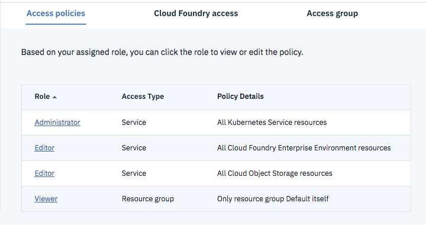

---

copyright:

  years: 2015, 2017, 2018

lastupdated: "2018-04-18"

---

{:shortdesc: .shortdesc}
{:new_window: target="_blank"}
{:codeblock: .codeblock}
{:pre: .pre}
{:screen: .screen}
{:tip: .tip}

# 許可權
{: #permissions}

使用者開始建立及使用 {{site.data.keyword.cfee_full}} 服務實例之前，要在其中建立實例之帳戶的管理者必須先正確設定他們的許可權。 

## 建立新環境所需的許可權
{: #perm-creating}

若要建立新的 CFEE 服務實例，帳戶管理者必須授與存取原則給使用者，不只是對 CFEE 服務本身，還有對建立 CFEE 時自動建立的支援服務。

需要下列 Identity & Access Management (IAM) 存取原則，使用者才能建立 {{site.data.keyword.cfee_full_notm}} 實例：

* {{site.data.keyword.Bluemix}} 帳戶中，對 **_Default_** **資源群組**的 _Viewer_（或更高）存取權。資源群組容許將資源組織成自訂分組，以協助對這些資源的存取控制。當您建立新的環境實例時，系統會提示您輸入資源群組。需要有對 _Default_ 資源群組的存取權，因為這一定是需要 Kubernetes 叢集的資源群組。使用者可以在不同的資源群組中佈建 CFEE 實例，但 Kuberetes 叢集仍將會佈建到 _Default_ 資源群組。如果使用者在不同的使用者群組中佈建 CFEE，該使用者將需要該資源群組的檢視者存取權。

* 在環境被指派到的資源群組中，對 {{site.data.keyword.cfee_full_notm}} 服務的管理者或編輯者角色。在 {{site.data.keyword.cfee_full_notm}} 服務中具有管理者或編輯者角色的使用者，可以建立及刪除環境。但是只有具有管理角色的使用者，才能將使用者指派給 {{site.data.keyword.cfee_full_notm}} 實例，或變更指派給該實例中使用者的角色。
   
* **Kubernetes 服務**資源的管理者角色。{{site.data.keyword.cfee_full_notm}} 實例部署在 Kubernetes 服務所提供的容器叢集基礎架構上。當您建立 {{site.data.keyword.cfee_full_notm}} 服務實例時，服務會自動建立 Kubernetes 叢集。需要對 Kubernetes 服務的存取權，才能建立該叢集基礎架構。您可以將 Kubernetes 服務原則的存取權範圍界定在打算佈建 CFEE 實例的特定地區，或是將存取權範圍界定在所有地區。

* **IBM Cloud Object Storage 服務**的管理者或編輯者角色，這是 CFEE 服務的必要相依關係。IBM Cloud Object Storage 服務實例用來儲存在建立 ICFEE 應用程式容器期間所產生的資料（例如：上傳的應用程式套件、建置套件及已編譯的執行檔）。

* Compose for PostgreSQL 服務實例是 CFEE 服務的必要相依關係。Compose for PostgreSQL 用來將 Cloud Foundry 資料儲存至 CFEE 實例（例如：審核應用程式部署、啟動及停止事件；保留 CFEE 使用者成員資格、組織、空間、應用程式及服務連線的記錄）。該 **Compose for PostgreSQL 服務**實例部署在您建立 {{site.data.keyword.cfee_full_notm}} 實例時所選取的公用 Cloud Foundry 組織（與 CFEE 組織無關）中。這表示當您建立 {{site.data.keyword.cfee_full_notm}} 實例時，需要對於打算佈建 CFEE 實例的位置中，至少一個組織具有管理員存取權。您開發人員需要對該組織中的至少一個空間具有開發人員存取權。 

  如果您不是打算建立 CFEE 實例之位置中，至少一個公用組織的成員，請要求 IBM Cloud 管理者邀請您加入一個公用組織。如果您在帳戶中有管理者角色，可以執行下列動作將使用者新增至帳戶裡的公用組織及空間：

     * 移至[**管理 > 帳戶 > Cloud Foundry 組織**](https://console.bluemix.net/account/organizations)，然後按一下**新增組織**或選取現有的組織。
     * 移至組織頁面頂端的**使用者**標籤。
     * 尋找需要建立 CFEE 實例的使用者。如果您想要他/她能夠建立 CFEE 實例的使用者不在清單中，請按一下表格上方的**新增或邀請使用者**，以將使用者新增或邀請至組織。
     * 移至組織頁面頂端的**空間**標籤。
     * 找到要佈建 Compose for PostgreSQL 服務實例的空間，然後勾選 **Developer** 角色勾選框。

下列畫面說明 {{site.data.keyword.Bluemix_notm}} 之「身分及存取」頁面中出現的存取原則，以容許使用者建立 {{site.data.keyword.cfee_full_notm}} 實例。

若要確認您具有建立 {{site.data.keyword.cfee_full_notm}} 實例所需的存取原則，請執行下列動作：
1. 移至 {{site.data.keyword.Bluemix_notm}} 標頭中的[**管理 > 帳戶 > 使用者**](https://console.bluemix.net/iam/#/users)功能表，以開啟**身分及存取**頁面。
2. 在「存取原則」標籤中，按一下將建立環境的使用者，以便指派和檢視該使用者的存取原則。

## 使用環境所需的許可權
{: #perm-working}

若要使用 {{site.data.keyword.cfee_full_notm}} 實例，使用者必須：
1. {{site.data.keyword.cfee_full_notm}} 實例建立所在之 {{site.data.keyword.Bluemix_notm}} 帳戶的成員。
2. 帳戶管理者已授與下列 IAM _存取原則_（請參閱 {{site.data.keyword.Bluemix_notm}} 標頭的[**管理 > 帳戶 > 使用者**](https://console.bluemix.net/iam/#/users)功能表下的_身分及存取_ 頁面，以檢查現行帳戶存取原則）：

  - 對環境實例建立所在資源群組中，{{site.data.keyword.cfee_full_notm}} 服務的存取權。使用者在 {{site.data.keyword.cfee_full_notm}} 實例中具有的存取及控制層次，取決於存取原則中所授與的角色：
     - 獲指派管理者或編輯者角色的使用者，可以建立組織、將管理員指派給組織及空間、具有環境內所有組織及空間的完整許可權，以及使用 Cloud Controller API 來執行作業動作。這些使用者會自動被授與 Cloud Foundry _使用者帳戶及鑑別範圍_ 中的 _cloud_controller.admin 範圍_。
     - 獲指派檢視者角色的使用者，可以在主要 {{site.data.keyword.Bluemix_notm}} 儀表板中看到該環境，而且可以開啟其使用者介面。對環境內特定組織及空間的使用者存取，是由這些組織及空間管理員所指派的特定組織及空間角色所控管。如需相關資訊，請參閱[將使用者新增至組織](add-users.html)。

此圖說明存取 {{site.data.keyword.cfee_full_notm}} 所需的最小存取原則（如同 {{site.data.keyword.Bluemix_notm}} _身分及存取_ 頁面中所出現的情形）。

