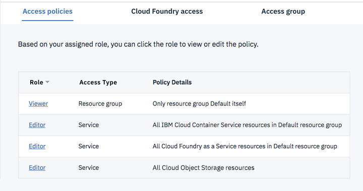

---

copyright:

  years: 2015, 2017, 2018

lastupdated: "2018-11-20"

---

{:shortdesc: .shortdesc}
{:new_window: target="_blank"}
{:codeblock: .codeblock}
{:pre: .pre}
{:screen: .screen}
{:tip: .tip}

# Permissions
{: #permissions}

Before users begin creating and working with instances of the {{site.data.keyword.cfee_full}} service, their permissions must be set correctly by an administrator of the account where the instance is to be created. 

## Permissions required to create a new environment
{: #perm-creating}

In order to create new instances of the CFEE service, users must be granted access policies by an account administrator, not only to the CFEE service itself, but also to the supporting services that are also created automatically when the CFEE is created.

The following Identity & Access Management (IAM) access policies are required for users to be able to create an {{site.data.keyword.cfee_full_notm}} instance:

* _Viewer_ (or higher) accesss to the **_Default_** **resource group** in the {{site.data.keyword.Bluemix}} account. Resource groups allow organizing resources into customized groupings to facilitate access control to those resources. You are prompted for a resource group when you create a new environment instance. Access to the _Default_ resource group is required because this is always the resource group where the Kubernetes cluster is required.  Users can provision the CFEE instance in a diferent resource group, but the Kuberetes cluster will still be provisioned to the _Default_ resource group.  If a user provisions the CFEE in different user group, that users will required viewer access in that resource group.

* _Administrator_ or _editor_ role to **{{site.data.keyword.cfee_full_notm}} service** resources. In the resource group to which the environment is assigned. Users with either administrator or editor roles in the {{site.data.keyword.cfee_full_notm}} service can create and delete environments. But only users with an administration role can assign users to an {{site.data.keyword.cfee_full_notm}} instance or change the roles that are assigned to users in that instance.
   
* _Administrator_ role to the **Kubernetes Service** resources.  Instances of the {{site.data.keyword.cfee_full_notm}} are deployed on container cluster infrastructure, which is provided by the Kubernetes service. When you create an instance of the {{site.data.keyword.cfee_full_notm}} service, the service automatically creates a Kubernetes cluster. Access to the Kubernetes Service is required for creating that cluster infrastructure. You can scope access to the Kubernetes Service policy to the specific region where you intend to provision the CFEE instance, or scope the access to all regions.

* _Administrator_ or _editor_ platform role, and manager service access role to the **IBM Cloud Object Storage service**, which is a required dependency of the CFEE service.  An instance of IBM Cloud Object Storage service is used to store data generated during the creation of your ICFEE application containers (e.g. uploaded application packages, buildpacks, and compiled executables).

* An instance of the Compose for PostgreSQL service is a required dependency of the CFEE service.  Compose for PostgreSQL is used to store Cloud Foundry data on your CFEE instance (e.g., auditing application deployment, start and stop events; keeping records of CFEE user membership, organizations, spaces, applications and service connections).  That instance of the **Compose for PostgreSQL service** is deployed in a space within a public Cloud Foundry organization (unrelated to CFEE organizations) that you select when creating a {{site.data.keyword.cfee_full_notm}} instance.  This means that when you create a {{site.data.keyword.cfee_full_notm}} instance you need to have _manager_ access to at least an organization in the location where you intend to provision the CFEE instance.  You also need _developer_ access to at least one space in that organization. 

  If you are not a member of at least one public organization in the location where you intend to create a CFEE instance, ask an IBM Cloud administrator to invite you to one. If you have administrator role in the account you can add users to public organizations and spaces in the account by performing the following:

     * Go to [**Manage > Account > Cloud Foundry Orgs**](https://console.bluemix.net/account/organizations) and either click on **Add an organization** or select an existing organization.
     * Go to the **Users** tab at the top of the organization's page.
     * Find the user who needs to create CFEE instances. If the user you want to be able to create CFEE instances is not in the list, click **Add or invite user** above the table to add or invite users to the organization.
     * Go to the **Spaces** tab at the top of organization's page.
     * Find the space where the instance of Compose for PostgreSQL service would be provisioned and check the **Developer** role checkbox.

The following screen illustrates access policies as they would appear in the Identity & Access page of the {{site.data.keyword.Bluemix_notm}} that allow a user to create an {{site.data.keyword.cfee_full_notm}} instance.



You can grant user permissions using the {{site.data.keyword.Bluemix}} command line.  You can also define an access policy for a user by specifying the parameters of the policy (i.e., services, roles, regions, etc) in a JSON formatted file that is invoked by the command that creates the policy.  See  [Assigning an IAM policy by using the command line](https://console.bluemix.net/docs/services/cloud-monitoring/security/assign_policy.html#assign_policy_commandline) for more information, or issue `ibmcloud iam -help` in the command line. Note that this requires installing the [IBM Cloud CLI](https://console.bluemix.net/docs/cli/reference/ibmcloud/download_cli.html#install_use).
{:tip}

To confirm that you have the required access policies to create an {{site.data.keyword.cfee_full_notm}} instance:
1. Go to the [**Manage > Account > Users**](https://console.bluemix.net/iam/#/users) menu in the {{site.data.keyword.Bluemix_notm}} header to open the **Identity & Access** page.
2. In the Access policies tab, click the user who is creating the environment to assign and view the access policies for that user.

For more information about managing users and access in the {{site.data.keyword.Bluemix}}, including how to organize a set of users and service IDs to facilitate access assignment to multiple users at a time, see [Managing users and access](https://console.bluemix.net/docs/iam/iamusermanage.html#iamusermanage).

### Expediting the setting of permissions to create an environment using the CLI
{: #permcli-creating}

You can expedite the setting of permissions for creating CFEE instances through the `ibmcloud cfee create-permission-set`.  The command allows a CFEE administrator to setup in a single command the required access policies for creating a CFEE instance and all its ancillary services. 

The command sets the permissions to an IAM _Access Group_ and adds a user to that _Access Group_.  The administrator issuing the command can include in the command an existing _Access Group_.  If no _Access Group_ is provided, a default _cfee-provision-access-group_ is created automatically.

```
ibmcloud cfee create-permission-set USER_NAME [-ag, --access-group GROUP_NAME] [--output TYPE]
```
{: pre}

The command sets the following access policies for the target user:

*  Editor roles to the Cloud Object Storage and CFEE services in the current IBM Cloud account.
*  Administrator role to the Kubernetes Service in the current IBM Cloud account.
*  Developer role to the current space in the current org for provisioning of the Compose for PostgreSQL.

For more details on the command issue the following:

```
cfee create-permission-set -help
```
{: pre}

You can use the `ibmcloud cfee create-permission-get` to find out or validate the access policies in place for a user:

```
ibmcloud cfee provision-permission-get USER_NAME [-ag, --access-group GROUP_NAME] [--output TYPE]
```
{: pre}

## Permissions required to work with an environment
{: #perm-working}

To work with a instance of the {{site.data.keyword.cfee_full_notm}}, users must be:
1. Members of the {{site.data.keyword.Bluemix_notm}} account where the {{site.data.keyword.cfee_full_notm}} instance was created.
2. Granted the following IAM _Access Policies_ by the account administrator (see the _Identity & Access_ page under the [**Manage > Account > Users**](https://console.bluemix.net/iam/#/users) menu in the {{site.data.keyword.Bluemix_notm}} header to check your current account access policies):

    All users need _viewer_ access or higher to the {{site.data.keyword.cfee_full_notm}} instance in the resource group under which the environment instance was created. The level of access and control that users have in an {{site.data.keyword.cfee_full_notm}} instance depends on the role that is granted in the access policy:
  - Users assigned _administrator_ or _editor_ roles can create organizations, assign managers to organizations and spaces, have full permissions to all organizations and spaces within the environment, and perform operational actions through the Cloud Controller API. These users are automatically granted _cloud_controller.admin scope_ in the Cloud Foundry _User Account and Authentication scope_.
  - Users with _viewer_ role to a CFEE can see it listed in the main {{site.data.keyword.Bluemix_notm}} dashboard and open its user interface. Users access to specific organizations and spaces within the environment is governed by the specific organization and spaces roles that are assigned by the managers of those organizations and spaces. For more information, see [Adding users to organizations](add-users.html).

     **Note:** A _viewer_ platform role to the resource group under which a CFEE instance is grouped is not, by itself, sufficient to make the CFEE visibile to a user.  Users need need explicit access to the CFEE instance (with _viewer_ role or higher) to have have visibility into that instance.

  - Users need _editor_ platform role or higher to an {{site.data.keyword.Bluemix_notm}} service to be able to **bind** an instance of that service to an application deployed in a CFEE space.

  - Users need _editor_ platform role or higher to a CFEE instance and _operator_ role or higher to the Kubernetes cluster into which the CFEE is provisioned to be able to **update the CFEE to a new version**.

  - Users need _administrator_ platform role to a CFEE instance and _operator_ role or higher to the Kubernetes cluster into which the CFEE is provisioned to be able to **change the capacity** of a cfee (adding or removing cells).
  
  - Users need _operator_ platform role (or higher) and _writer_ service role (or higher) to a service instance to be able to *bind* that service instance to an application deployed in a CFEE space.

