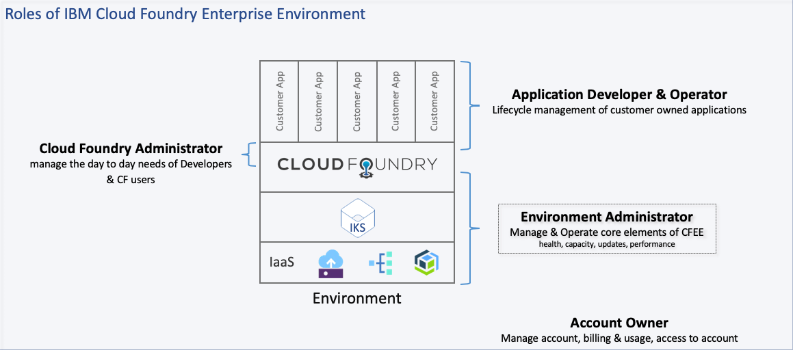

---

copyright:

  years: 2018, 2019

lastupdated: "2019-03-21"

---

# Roles and responsibilities
{: #rolesresponsibilities}

During the lifecycle of an {{site.data.keyword.cfee_full}} instance there is a shared responsibility between the customer and
{{site.data.keyword.IBM}} to take care of administrative and operational tasks. The customer can delegate these tasks to a managed service
provider. A list of available managed service providers will be made available on this page at a later time.

This page gives an overview on roles and responsibilities during the lifecycle of an {{site.data.keyword.cfee_full}}. 

## Roles
{: #roles}

The following list shows the roles and responsibilities:

<dl>
<dt>**IBM Cloud Account Owner** - manage the onboarding and support of users to IBM Cloud</dt>
    <ol type="a">
      <li>Add Cloud Foundry administrator(s) and developer(s) to IBM Cloud account</li>
      <li>Setup proper resource groups, IAM groups, IAM policies</li>
      <li>Responsible for the overall account resources (including {{site.data.keyword.cfee_short}} instances)</li>
      <li>Provisioning services and adding services to an {{site.data.keyword.cfee_short}}
    </ol>

<dt>**Cloud Foundry Administrator** - manage the day to day requirements of development teams and Cloud Foundry users</dt>
  <ol type="a">
    <li>Creates Cloud Foundry organizations inside {{site.data.keyword.cfee_short}}</li>
    <li>Assigns developers to Cloud Foundry roles within organizations and spaces inside {{site.data.keyword.cfee_short}}</li>
    <li>Has Cloud Foundry administrator access (aka cc.admin authority) inside {{site.data.keyword.cfee_short}}</li>
  </ol>

<dt>**Application Developer & Administrator** - lifecycle management of customer owned applications</dt>
  <ol type="a">
    <li>Has developer access to CF organizations and spaces</li>
    <li>Maintains the current state of applications, deploys new applications and updates existing ones.</li>
    <li>Binding service instances to applications</li>
    <li>Manage space membership and roles</li>
    <li>Manage domains and SSL certificates</li>
  </ol>
</dl>

<dt>**{{site.data.keyword.cfee_short}} "Stack" Administrator** - manage all elements of an {{site.data.keyword.cfee_short}} instance(s)</dt>
  <ol type="a">
    <li>Availability, health and performance monitoring</li>
    <li>Version management (upgrading to new {{site.data.keyword.cfee_short}} versions, includes communicating, negotiating and defining with stakeholders the decision and timing of updates)</li>
    <li>Capacity management of {{site.data.keyword.cfee_short}} (adding or removing Cloud Foundry cells)</li>
    <li>Has {{site.data.keyword.cfee_short}} administrator access (aka cc.admin authority)</li>
    <li>Infrastructure management around network and storage management as related to an {{site.data.keyword.cfee_short}} instance</li>
    <li>Management of {{site.data.keyword.cfee_short}} pre-req services (plan upgrades, availability), e.g. Kubernetes, VMs hosting IKS workers, Cloud Object Store, Postgres</li>
    <li>Incident management for Cloud Foundry, {{site.data.keyword.cfee_short}}, IaaS (as related to an {{site.data.keyword.cfee_short}} instance)</li>
  </ol>

  **Note:** being a "stack" administrator there is a large number of IaaS related responsibilities - for customers who use a significant amount of IBM Cloud resources, there is a tendency to break up this Role between a {{site.data.keyword.cfee_short}} role and an IaaS role.

## Responsibilities
{: #responsibilities}

From setting up your environment to ongoing operations, a variety of tasks must be completed. The following tables outline the required tasks and the owner for completing the task throughout the provisioning, operations and de-provisioning phases.

The provisioning phase is used to create an {{site.data.keyword.cfee_short}} instance. The operational phase describes the on-going tasks and responsibilities while using an {{site.data.keyword.cfee_short}} instance. The final phase of de-provisioning lists all tasks at the end of the lifecycle of an {{site.data.keyword.cfee_short}} instance.

The tables below will refer to the managed service provider as MSP, whether the managed service will be provided by {{site.data.keyword.IBM}} or a 3rd party company.

### Responsibilities of the IBM Cloud Account Owner

| **Task**                                | **Task details**                                                                                                                                                                                                                                                                                                      | **responsible party** |
|-----------------------------------------|-----------------------------------------------------------------------------------------------------------------------------------------------------------------------------------------------------------------------------------------------------------------------------------------------------------------------|-----------------------|
| **Provisioning Phase**                  |                                                                                                                                                                                                                                                                                                                       |                       |
| Design solution                         | Architectural decisions surrounding one or multiple {{site.data.keyword.cfee_short}}, like choosing the target region and zone.                                                                                                                                                                                       | Customer              |
| Configure environment                   | Configure environment based on available options.                                                                                                                                                                                                                                                                     | Customer              |
| Provision environment                   | The provisioning process of an {{site.data.keyword.cfee_full_notm}} is completely automated.                                                                                                                                                                                                                          | Customer              |
| Start managed service agreement         | At this point in time opting for the managed service for an {{site.data.keyword.cfee_short}} instance can only be done at provisioning time. Access to the prerequisite services like IBM Kubernetes Service, PostgreSQL and Cloud object storage is restricted during the lifetime of the managed service agreement. | N/A                   |
| Meet compliance standards               | Based on compliance readiness of {{site.data.keyword.cfee_short}} for various standards like HIPAA, SOC etc. all involved parties need to ensure compliance within their teams in order to reach compliance of the complete stack for a certain standard.                                                             | Customer + IBM        |
| Compliance requirements                 | Verify that the compliance certifications match the intended workload.                                                                                                                                                                                                                                                | Customer              |
| **Operational Phase**                   |                                                                                                                                                                                                                                                                                                                       |                       |
| Administration of the IBM Cloud Account | Give permissions to access {{site.data.keyword.cfee_short}} as well as the prerequired services like {{site.data.keyword.containershort}}, {{site.data.keyword.databases-for-postgresql_full_notm}} and {{site.data.keyword.cos_full_notm}}.                                                                          | Customer              |
| **De-Provisioning Phase**               |                                                                                                                                                                                                                                                                                                                       |                       |
| End managed service agreement           | Ending the contract for the managed service for {{site.data.keyword.cfee_short}} is effective at the end of the current billing period.                                                                                                                                                                               | N/A                   |
| Final backup                            | Please refer to the backup task.                                                                                                                                                                                                                                                                                      | Customer              |
| Delete environment                      | Deleting the environment can be triggered by the customer. It will also clean up the pre-requirements, i.e. the instance of the IBM Kubernetes Service, the instance of PostgreSQL and the instance of IBM Cloud Object Storage created during the deployment of the {{site.data.keyword.cfee_full_notm}}.            | Customer              |
| Remove customer network firewall rules  | Remove the firewall rules enabling network connectivity between IBM and the customer environment.                                                                                                                                                                                                                     | Customer              |
| Recycle infrastructure                  | The services required to operate your CFEE (e.g. IBM Cloud Object Store or PostgreSQL database) will be recycled based on the {{site.data.keyword.BluSoftlayer}}-defined processes.                                                                                                                                   | IBM                   |
{: caption="Table 1. IBM Cloud Account Owner tasks" caption-side="top"}

### Responsibilities of the Cloud Foundry Administrator

| **Task**                     | **Task details**                                                                           | **responsible party** |
|------------------------------|--------------------------------------------------------------------------------------------|-----------------------|
| **Operational Phase**        |                                                                                            |                       |
| Perform administrative tasks | Perform administrative tasks like creating orgs, spaces and assigning Cloud Foundry roles. | Customer              |
{: caption="Table 2. Cloud Foundry Administrator tasks" caption-side="top"}

### Responsibilities of the {{site.data.keyword.cfee_full_notm}} Stack Administrator

| **Task**                                                       | **Task details**                                                                                                                                                                                                                                       | **{{site.data.keyword.cfee_short}} responsible party** |
|----------------------------------------------------------------|--------------------------------------------------------------------------------------------------------------------------------------------------------------------------------------------------------------------------------------------------------|--------------------------------------------------------|
| **Operational Phase**                                          |                                                                                                                                                                                                                                                        |                                                        |
| Create and execute disaster recovery plan                      | Define the disaster recovery requirements, the disaster recovery plan and execute the plan in case of a disaster.                                                                                                                                      | Customer                                               |
| Create backup and recovery plan                                | Create a backup and recovery plan that defines the frequency and the requirements for on-and-off site distribution of the backup. You back-up any application-specific data that you are responsible for.                                              | Customer                                               |
| Identify tools for event detection and problem determination   | Identify IBM and third-party tools used for event detection and problem determination at the {{site.data.keyword.cfee_short}} platform level.                                                                                                          | Customer                                               |
| Define escalation policy                                       | Define the escalation policy to triage and resolve events detected from the monitoring components.                                                                                                                                                     | Customer                                               |
| Install and configure security and audit components            | Install and configure security components that are tied into the monitoring and escalation plan, e.g. Logging Service or Activity Tracker.                                                                                                             | Customer                                               |
| Configure and maintain network connectivity                    | Establish initial network configuration including firewall rules and DNS.                                                                                                                                                                              | Customer                                               |
| Customize external solution components                         | For instance configure load balancers for disaster recovery scenarios.                                                                                                                                                                                 | Customer                                               |
| Track status for security, compliance and audit controls       | Track status up to the point where all tools and processes are in place to achieve identified compliance.                                                                                                                                              | Customer                                               |
| Continuous capacity planning and execution                     | Monitor capacity and add or remove capacity as your needs change.                                                                                                                                                                                      | Customer                                               |
| Curate upgrade resp. maintenance versions (IKS, Postgres, COS) | Curate, package and validate {{site.data.keyword.cfee_short}} install and upgrade images, incl. fixes for security vulnerabilities.                                                                                                                    | IBM                                                    |
| Publish upcoming updates and maintenance                       | Create documentation for the required maintenance.                                                                                                                                                                                                     | IBM                                                    |
| Schedule and apply maintenance                                 | In order to stay within the supported versions the stack administrator needs to apply major and minor updates to an {{site.data.keyword.cfee_short}} instance. {{site.data.keyword.IBM}} will support n-2 versions of {{site.data.keyword.cfee_short}} | Customer                                               |
| Address provisioning failures                                  | Fix provisioning failures, if they occur, for customer-created services that are deployed to the Catalog.                                                                                                                                              | Customer                                               |
| Perform network and IP scans                                   | Perform daily and monthly network and IP scans.                                                                                                                                                                                                        | Customer                                               |
| Conduct testing                                                | Conduct periodic key controls over operations testing and third-party penetration testing.                                                                                                                                                             | Customer                                               |
| Compliance execution                                           | Make sure the overall solution (Application + {{site.data.keyword.cfee_short}} Platform) is compliant regarding required certifications.                                                                                                               | Customer                                               |
| Status reporting, audit coordination, and compliance meetings  | Complete status reporting, external audit coordination, and representation at compliance review status meetings.                                                                                                                                       | Customer                                               |
| Employment and business need verification                      | Complete quarterly employment verification and verification of continued business need for IBM representatives that have access to the customer environment.                                                                                           | Customer                                               |
{: caption="Table 3. {{site.data.keyword.cfee_short}} Stack Administrator tasks" caption-side="top"}

### Responsibilities of the Application Developer & Administrator

| **Task**                       | **Task details**                                                                          | **responsible party** |
|--------------------------------|-------------------------------------------------------------------------------------------|-----------------------|
| **Operational Phase**          |                                                                                           |                       |
| Deploy and manage applications | Deploy, scale, update and delete applications on top of {{site.data.keyword.cfee_short}}. | Customer              |
{: caption="Table 4. Application Developer & Administrator tasks" caption-side="top"}
